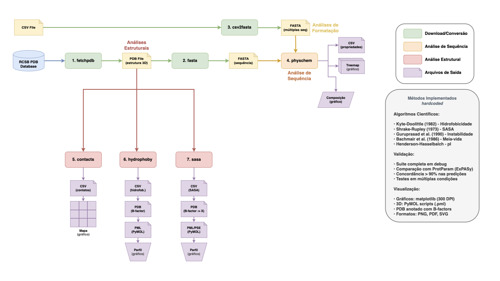

# BioHub

*Uma Plataforma para Análise de Sequências e Estruturas de Proteínas*

---


[](https://www.python.org/)
[](#)
[](https://www.wwpdb.org/)
[](https://en.wikipedia.org/wiki/Comma-separated_values)
[](https://en.wikipedia.org/wiki/FASTA_format)


**BioHub** é uma ferramenta de linha de comando leve, prática e centralizadora, escrita em Python puro, para realizar análises bioinformáticas a partir de arquivos de estrutura de proteínas (PDB) e sequências de aminoácidos.


```
██████╗ ██╗ ██████╗ ██╗  ██╗██╗   ██╗██████╗ 
██╔══██╗██║██╔═══██╗██║  ██║██║   ██║██╔══██╗
██████╔╝██║██║   ██║███████║██║   ██║██████╔╝
██╔══██╗██║██║   ██║██╔══██║██║   ██║██╔══██╗
██████╔╝██║╚██████╔╝██║  ██║╚██████╔╝██████╔╝
╚═════╝ ╚═╝ ╚═════╝ ╚═╝  ╚═╝ ╚═════╝ ╚═════╝ 
```

---

## Equipe Desenvolvedora (Programa de Pós Graduação em Bioinformática - UFMG)

- Alisson Clementino da Silva (ACDS)
- Ana Karoline da Nóbrega Nunes Alves (AKNA)
- Laura da Silva Ribeiro de Souza (LSRS)
- Leonardo Henrique da Silva (LHS)
- Madson Allan de Luna Aragão (MADLA)

### Disclaimer

O BioHub é uma ferramenta desenvolvida com código hardcoded como projeto acadêmico. Após a conclusão da disciplina, o grupo irá implementar bibliotecas especializadas para que os cálculos sejam feitos com maior acurácia e elegância, pretendendo utilizar o software em nossas rotinas científicas.

Gostaríamos de agradecer aos professores **Lucas Bleicher**, **Rafaela Ferreira** e **Vinicius Maltarollo** pelo desafio proposto e pelo desenvolvimento do nosso pensamento crítico sem a praticidade das bibliotecas especializadas do Python. Este exercício foi fundamental para compreendermos profundamente os algoritmos e métodos bioinformáticos que frequentemente utilizamos, sem nos preocupamos com os detalhes do processamento dos nossos dados. 

---

## Visão Geral

Este projeto foi desenvolvido com o objetivo de fornecer uma solução simples, rápida e altamente portátil para tarefas comuns na análise de proteínas. É ideal para:

* **Fins educacionais**: Demonstra a implementação de algoritmos bioinformáticos fundamentais sem a abstração de bibliotecas complexas.
* **Integração em pipelines**: A natureza leve e a interface de linha de comando facilitam a automação de análises em scripts de shell.
* **Acessibilidade**: Não requer bibliotecas externas para cálculos, podendo ser executada em qualquer ambiente com uma instalação padrão do Python 3, eliminando problemas de gerenciamento de dependências.

---

## Validação e Testes 

### Testes: `debug/`

A pasta **`debug/`** contém um conjunto completo de testes de todas as funcionalidades e possibilidades de análises do BioHub. Esses testes foram baseados no case de apresentação descrito em **`demoday-biohub/README.md`**, que utiliza a proteína **p53 (PDB ID: 1TUP)** como modelo.

**Estrutura dos testes realizados:**

```
debug/
├── 00-fetchpdb/     → Download automático da estrutura 1TUP
├── 01-fasta/        → Conversão PDB → FASTA
├── 02-physchem/     → Predições físico-químicas completas
├── 03-csv2fasta/    → Conversão CSV → FASTA
├── 04-contacts/     → Análise de contatos intramoleculares
├── 05-hydrophoby/   → Perfil de hidrofobicidade por resíduo
└── 06-sasa/         → Área de superfície acessível ao solvente
```

Cada teste exercita todas as opções disponíveis de cada comando (saídas em CSV, PDB anotado, scripts PyMOL e visualizações gráficas), garantindo a robustez e confiabilidade da ferramenta.

### Funções de Conversão e Download

As funções **`fetchpdb`**, **`fasta`** (PDB → FASTA) e **`csv2fasta`** foram testadas em **diversas condições de ruído** e se saíram com **sucesso em todas as ocasiões**. Isso inclui:

- **Arquivos PDB com registros malformados** ou não padronizados
- **CSVs com diferentes delimitadores** (vírgula, ponto-e-vírgula, tabulação)
- **Sequências com caracteres ambíguos** ou espaços extras
- **Diferentes formatos de cabeçalho** e encodings de texto
- **Estruturas PDB com múltiplas cadeias** e heteroátomos complexos

Essa robustez garante que o BioHub pode processar dados de diversas fontes sem falhas, sendo uma ferramenta confiável para pipelines automatizados.

### Validação com ProtParam (ExPASy)

**Nossas predições computacionais hardcoded foram comparadas com o [ProtParam](https://web.expasy.org/protparam/), uma plataforma bem estabelecida e amplamente utilizada da ExPASy (Swiss Institute of Bioinformatics).**

**Resultados da validação:**
* **Peso Molecular**: Predições idênticas ou com variações inferiores a 0.01%
* **Ponto Isoelétrico (pI)**: Concordância total com diferenças menores que 0.05 unidades de pH
* **Coeficiente de Extinção (ε₂₈₀)**: Valores exatos quando comparados com mesmas premissas de pontes dissulfeto
* **Índice de Instabilidade**: Classificações concordantes (estável vs. instável)
* **Índice Alifático e GRAVY**: Variações desprezíveis (<1%), dentro da margem de erro aceitável para arredondamentos

Esta validação demonstra que, apesar da implementação hardcoded sem uso de bibliotecas especializadas, **o BioHub produz resultados científicos confiáveis e comparáveis a ferramentas consolidadas da comunidade bioinformática internacional**.

### SASA e Hidrofobicidade

Os cálculos de **SASA** e **hidrofobicidade** utilizam métodos computacionais bem estabelecidos e amplamente validados pela comunidade científica:

**Hidrofobicidade:**
- Implementação da **escala de Kyte-Doolittle (1982)**, um dos métodos mais consagrados para quantificar o caráter hidrofóbico/hidrofílico de aminoácidos
- Gera **PDB especial com B-factors anotados** com valores de hidrofobicidade
- Produz **script .pml para PyMOL**, permitindo a **inspeção visual e comprovação das predições** diretamente na estrutura tridimensional
- Facilita a identificação de regiões hidrofóbicas (núcleo) vs. hidrofílicas (superfície)

**SASA (Solvent Accessible Surface Area):**
- Implementação do **algoritmo de Shrake-Rupley (1973)**, um dos métodos mais consagrados para cálculo de área de superfície acessível ao solvente
- Utiliza esferas de pontos e raios de Van der Waals tabelados para precisão
- Gera **PDB anotado com valores de SASA no campo B-factor** (média por resíduo)
- Produz **script PyMOL (.pml)** para **visualização e comprovação das predições na estrutura 3D**
- Permite interpretação biológica direta: resíduos enterrados vs. expostos ao solvente

Ambos os módulos facilitam a **validação visual das predições computacionais** através de visualização molecular interativa no PyMOL, aumentando a confiança nos resultados.

---

### Abordagem Implementacional

O BioHub foi **intencionalmente desenvolvido com código hardcoded**, utilizando conhecimento científico consolidado sobre as propriedades físico-químicas dos aminoácidos e dados proteicos. Quase a totalidade do código (com exceção das visualizações gráficas) implementa algoritmos e cálculos diretamente, sem dependências de bibliotecas externas de bioinformática.

**Métodos científicos implementados:**

* **Propriedades físico-químicas (physchem)**: Implementação de múltiplos métodos consolidados:
  - Peso molecular com valores tabelados de massa atômica
  - Ponto isoelétrico (pI) usando equação de Henderson-Hasselbalch e valores de pKa da literatura
  - **Escala de Kyte-Doolittle** para hidropaticidade (GRAVY)
  - **Índice de Instabilidade** de Guruprasad et al. (1990)
  - **Meia-vida** baseada na regra do N-terminal de Bachmair et al. (1986)
  - Coeficiente de extinção molar (ε₂₈₀) baseado em Trp, Tyr e pontes dissulfeto

* **Análise estrutural (contacts)**: Cálculo euclidiano de distâncias 3D entre **todos os átomos** dos resíduos para identificação de contatos intramoleculares (considera a distância mínima entre quaisquer átomos de dois resíduos)

* **Hidrofobicidade (hydrophoby)**: Aplicação da **escala de Kyte-Doolittle (1982)** por resíduo

* **SASA (sasa)**: Implementação do **algoritmo de Shrake-Rupley (1973)** com esferas de pontos e raios de Van der Waals tabelados

* **Scripts PyMOL (.pml)**: Geração automatizada de arquivos de script PyMOL seguindo as normas da documentação oficial do PyMOL para visualização 3D dos PDBs anotados gerados pelo BioHub

* **Visualizações (matplotlib)**: Única exceção autorizada (Prof. Vinícius Maltarollo) - uso do matplotlib e numpy para enriquecer visualmente os outputs científicos, sem alterar os cálculos principais

---

## Como Funciona

A BioHub foi intencionalmente construída utilizando apenas a biblioteca padrão do Python. Constantes físico-químicas, como pesos moleculares e escalas de hidropatia, são armazenadas localmente em dicionários.

**Justificativa**: Esta abordagem garante a portabilidade e simplicidade para análise de estrutura de proteínas. Embora o uso de bancos de dados externos ou pacotes especializados pudesse oferecer maior precisão ou dados mais atualizados, a implementação atual é suficiente para fins demonstrativos e educacionais, focando na lógica algorítmica.

---

## AVISOS IMPORTANTES: BioHub v0.1.3

### Requisitos Obrigatórios de Entrada

**O BioHub na versão atual requer arquivos PDB pré-processados e limpos:**

1. **Use SEMPRE o módulo `fetchpdb` para obter arquivos PDB limpos:**
   ```bash
   python3 biohub.py fetchpdb [PDB_ID] --chains A --protein-only -o arquivo_limpo.pdb
   ```

2. **Requisitos do arquivo PDB:**
   - **Uma única cadeia** (`--chains A` ou cadeia específica)
   - **Apenas proteína** (`--protein-only` remove água, ligantes e heteroátomos)
   - **Não utilize arquivos PDB brutos** baixados manualmente ou de outras fontes sem processamento

3. **Especificação de Output é OBRIGATÓRIA:**
   - **TODOS os módulos** (`physchem`, `contacts`, `hydrophoby`, `sasa`) **requerem sinalização de output** através de flags apropriadas
   - **Sem especificação de output**, os módulos podem **rodar indefinidamente sem retornar resultados**
   - Sempre use: `-o arquivo.csv`, `--write-pdb`, `--plot-*`, ou outras flags de saída específicas

4. **Exemplo de Workflow Correto:**
   ```bash
   # Passo 1: Obter PDB limpo
   python3 biohub.py fetchpdb 3E9C --chains A --protein-only -o 3E9C_clean.pdb

   # Passo 2: Extrair sequência
   python3 biohub.py fasta 3E9C_clean.pdb -o 3E9C.fasta

   # Passo 3: Análises (Sempre com flags de output)
   python3 biohub.py physchem "SEQUENCIA" -o physchem.csv
   python3 biohub.py contacts 3E9C_clean.pdb -o contacts.csv
   python3 biohub.py hydrophoby 3E9C_clean.pdb -o hydro.csv --plot-hydrophoby hydro.png
   python3 biohub.py sasa 3E9C_clean.pdb -o sasa.csv --plot-profile sasa.png
   ```

**Importante: Não seguir estas diretrizes pode resultar em:**
- Erros de `KeyError` 
- Cálculos que nunca finalizam ou travamentos
- Resultados ausentes

---

## Funcionalidades Detalhadas

A ferramenta é organizada em sete subcomandos principais:

### 1. `fetchpdb`

Faz o download automático de arquivos PDB diretamente do banco de dados RCSB (Protein Data Bank). Basta fornecer o código PDB de 4 caracteres e a ferramenta baixará a estrutura correspondente.

**Recursos adicionais:**
* Extrai informações do cabeçalho do arquivo PDB (título, data de deposição, classificação, organismo de origem)
* Permite especificar um nome customizado para o arquivo de saída
* Validação automática do código PDB fornecido

### 2. `fasta`

Converte um arquivo PDB em uma sequência no formato FASTA. O processo foca nos registros `ATOM` e extrai a sequência de aminoácidos da primeira cadeia (chain) encontrada no arquivo.

### 3. `csv2fasta`

Converte arquivos CSV contendo sequências de aminoácidos para o formato FASTA. Esta funcionalidade é especialmente útil para processar grandes volumes de sequências armazenadas em planilhas ou bancos de dados tabulares. O CSV input deve conter apenas duas colunas com as variáveis "ID" e "sequência de aminoácidos".

**Recursos configuráveis:**
* Suporte para delimitadores customizados (vírgula, ponto-e-vírgula, tabulação, etc.)
* Especificação de colunas por nome ou índice numérico
* Opção para processar cabeçalhos na primeira linha
* Flexibilidade para mapear qualquer coluna como identificador ou sequência

### 4. `physchem`

Calcula um conjunto expandido de propriedades físico-químicas essenciais para uma dada sequência de aminoácidos:

* **Peso Molecular (MW)**: A massa da molécula, fundamental para experimentos de espectrometria de massa e SDS-PAGE.
* **Ponto Isoelétrico (pI)**: O pH no qual a proteína tem carga líquida zero, influenciando sua solubilidade e comportamento em cromatografia de troca iônica.
* **Coeficiente de Extinção**: Estima como a proteína absorve luz a 280 nm, útil para determinar a concentração da proteína via espectrofotometria.
* **GRAVY (Grand Average of Hydropathicity)**: Um índice do caráter hidrofóbico ou hidrofílico geral de uma proteína. Valores positivos indicam hidrofobicidade (ex.: proteínas de membrana), enquanto valores negativos indicam hidrofilicidade (ex.: proteínas citosólicas).
* **Índice Alifático**: Medida do volume ocupado por cadeias laterais alifáticas (Ala, Val, Ile, Leu), correlacionado com a estabilidade térmica da proteína.
* **Índice de Instabilidade**: Prevê se a proteína é estável ou instável em ambientes fisiológicos (valores > 40 indicam instabilidade).
* **Meia-vida**: Estimativa da meia-vida da proteína em *E. coli* (*in vitro*) com base no resíduo N-terminal.
* **Composição de Aminoácidos**: A contagem e a frequência de cada resíduo, incluindo contagens de resíduos ácidos, básicos, polares e apolares.

### 5. `contacts`

Identifica e lista contatos intramoleculares com base na **distância mínima entre quaisquer átomos** de dois resíduos. Diferente de abordagens que usam apenas carbonos alfa, este método considera todos os átomos da cadeia lateral e backbone, proporcionando uma análise mais precisa e completa das interações. Este cálculo é útil para:

* Identificar o núcleo hidrofóbico (core) da proteína com maior precisão.
* Analisar a topologia do enovelamento considerando cadeias laterais.
* Estudar interações de longo alcance que estabilizam a estrutura terciária.
* Detectar contatos entre cadeias laterais que não seriam visíveis apenas com Cα.
* Ajuste customizável do limiar de distância (padrão: 8.0 Å).

**Nota técnica:** O cálculo é feito avaliando todos os pares de átomos entre dois resíduos e selecionando a distância mínima encontrada. Esta abordagem detecta significativamente mais contatos e com distâncias menores comparado ao método tradicional de Cα.

### 6. `hydrophoby`

Calcula a **hidrofobicidade** de cada átomo da proteína utilizando a **escala de Kyte-Doolittle**. Todos os átomos de um resíduo recebem o valor de hidrofobicidade característico daquele aminoácido. Esta análise é fundamental para:

* Identificar regiões hidrofóbicas (núcleo da proteína) vs. hidrofílicas (superfície)
* Predizer exposição ao solvente baseada no caráter químico dos resíduos
* Mapear o perfil de hidrofobicidade ao longo da estrutura 3D
* Visualizar propriedades físico-químicas diretamente na estrutura (usando B-factor)

### 7. `sasa`

Calcula a **Área de Superfície Acessível ao Solvente (SASA)** usando o algoritmo de Shrake-Rupley implementado em Python puro. Esta métrica é fundamental para estudos de enovelamento, estabilidade e interações moleculares.

**Características do cálculo:**
* Raio da sonda customizável (padrão: 1.4 Å para água)
* Número de pontos ajustável para controle de precisão (padrão: 200 pontos)
* Cálculo por resíduo e SASA total da molécula
* Uso de raios de Van der Waals específicos para cada tipo de átomo

**Nota sobre Performance (v0.1.3):**
* O padrão foi reduzido de 960 para 200 pontos por questões de performance
* Com 960 pontos, o cálculo pode ser extremamente lento (>10-20 minutos) ou travar em estruturas médias/grandes
* 200 pontos oferece bom balanceamento entre precisão e tempo de execução (~2-8 minutos)
* Para maior precisão, aumente manualmente com `--num-points` (ex: 500, 960, ou 2000)

---

<p align="center">
  
</p>

---

## Requisitos

### Requisitos Mínimos

* Python 3.x (biblioteca padrão)

---

## Instalação

**RECOMENDADO: Siga esta ordem para configurar o BioHub corretamente**

### 1. Clone o repositório

```bash
git clone https://github.com/madsondeluna/biohub.git
cd biohub
```

### 2. Crie um ambiente virtual (venv)

**Criar o ambiente virtual é ESSENCIAL para isolar as dependências do projeto:**

```bash
# No macOS/Linux:
python3 -m venv venv

# No Windows:
python -m venv venv
```

### 3. Ative o ambiente virtual

```bash
# No macOS/Linux:
source venv/bin/activate

# No Windows:
venv\Scripts\activate
```

**Você verá `(venv)` no início do seu prompt quando o ambiente estiver ativado.**

### 4. Instale as dependências

```bash
pip install -r requirements.txt
```

**O que está incluído no `requirements.txt`:**
- `matplotlib` - Para gráficos de composição, hidrofobicidade, SASA e mapas de contatos
- `numpy` - Para cálculos numéricos nas visualizações
- `squarify` - Para treemaps hierárquicos de composição de aminoácidos

### 5. Verifique a instalação

```bash
python biohub.py -h
```

Se você ver o banner do BioHub e a ajuda, está tudo certo!

---

### Dependências do Projeto

**BioHub Core (biohub.py):**
- Usa apenas a biblioteca padrão do Python 3
- Funciona sem dependências externas
- Bibliotecas usadas: `sys`, `math`, `argparse`, `subprocess`, `os`, `tempfile`, `shutil`, `csv`, `urllib.request`, `collections`

**Visualizações (biohub_viz.py):**
- Requer bibliotecas externas listadas no `requirements.txt`
- As visualizações são **opcionais** - o BioHub funciona sem elas
- Se as bibliotecas não estiverem instaladas, os gráficos não serão gerados, mas todas as análises continuam funcionando

### Notas Importantes

**Sempre ative o ambiente virtual antes de usar o BioHub:**
```bash
source venv/bin/activate  # macOS/Linux
venv\Scripts\activate     # Windows
```

**Para desativar o ambiente virtual quando terminar:**
```bash
deactivate
```

**Verificar instalação do Python:**
```bash
python3 --version  # ou python --version
```

Se o Python não estiver instalado, baixe em: https://www.python.org/downloads/

---

## Uso

A ferramenta é executada a partir do terminal, seguindo o padrão:

```bash
python3 biohub.py [COMANDO] [ARGUMENTOS] [OPÇÕES]
```

Ou, se o arquivo for executável:

```bash
./biohub.py [COMANDO] [ARGUMENTOS] [OPÇÕES]
```

---

> Exemplo de tela do BioHub em uso via CLI:

<p align="center">
  
</p>

---

### Ajuda (ou `biohub.py -h`)

```bash
python3 biohub.py -h
```

**Saída:**
```
biohub.py [-h] {fetchpdb,fasta,csv2fasta,physchem,contacts,hydrophoby,sasa} ...

BioHub: Uma ferramenta CLI para análise de proteínas.

positional arguments:
  {fetchpdb,fasta,csv2fasta,physchem,contacts,hydrophoby,sasa}
                        Função a ser executada
    fetchpdb            Baixa um arquivo PDB do RCSB.
    fasta               Converte um arquivo PDB em uma sequência FASTA.
    csv2fasta           Converte um arquivo CSV em um formato FASTA.
    physchem            Calcula propriedades físico-químicas de uma sequência.
    contacts            Calcula contatos intramoleculares a partir de um arquivo PDB.
    hydrophoby          Calcula a hidrofobicidade usando a escala Kyte-Doolittle.
    sasa                Calcula a Área de Superfície Acessível ao Solvente (SASA).

optional arguments:
  -h, --help            show this help message and exit

Use biohub.py COMANDO -h para ajuda detalhada sobre um comando.
```

---

## Exemplos Detalhados

### 1) Baixar Arquivo PDB do RCSB

Baixar a estrutura 1A2B com o nome padrão:

```bash
python3 biohub.py fetchpdb 1A2B
```

Baixar e salvar com nome customizado:

```bash
python3 biohub.py fetchpdb 1A2B -o minha_proteina.pdb
```

**Baixar apenas cadeias específicas:**

```bash
python3 biohub.py fetchpdb 4HHB --chains A,B -o hemoglobina_AB.pdb
```

**Baixar apenas proteína (remove água e ligantes):**

```bash
python3 biohub.py fetchpdb 1CRN --protein-only -o crambin_clean.pdb
```

**Combinar filtros (cadeia específica sem água/ligantes):**

```bash
python3 biohub.py fetchpdb 4HHB --chains A --protein-only -o hemo_A_clean.pdb
```

**Ajuda do comando:**
```bash
python3 biohub.py fetchpdb -h
```

**Opções disponíveis:**
* `PDB_ID`: O código de 4 caracteres do PDB (obrigatório)
* `-o, --output ARQUIVO`: Nome do arquivo de saída (padrão: `PDBID.pdb`)
* `--chains CHAINS`: Cadeias a serem mantidas, separadas por vírgula (ex: A,B). Se omitido, mantém todas
* `--protein-only`: Mantém apenas átomos de proteína (remove água, ligantes e heteroátomos)

**Benefícios da filtragem:**
- **Redução de tamanho**: Arquivos menores e mais rápidos para processar
- **Foco na análise**: Remove elementos não essenciais para análise de estrutura de proteínas
- **Preparação para simulações**: Muitos softwares de simulação requerem apenas a proteína
- **Análise por subunidades**: Permite estudar cadeias individuais de complexos proteicos

---

### 2) Converter PDB para FASTA

Exibir a sequência no terminal:

```bash
python3 biohub.py fasta proteina.pdb
```

Salvar a sequência em um arquivo:

```bash
python3 biohub.py fasta proteina.pdb -o proteina.fasta
```

**Ajuda do comando:**
```bash
python3 biohub.py fasta -h
```

**Opções disponíveis:**
* `ARQUIVO_PDB`: Caminho para o arquivo PDB de entrada (obrigatório)
* `-o, --output ARQUIVO`: Salva a saída em um arquivo FASTA (padrão: stdout)

---

### 3) Converter CSV para FASTA

Converter com configurações padrão (colunas 0 e 1, sem cabeçalho):

```bash
python3 biohub.py csv2fasta sequencias.csv
```

Converter especificando colunas por nome (com cabeçalho):

```bash
python3 biohub.py csv2fasta sequencias.csv --header --id-col "ID" --seq-col "Sequencia" -o saida.fasta
```

Converter com delimitador customizado (ponto-e-vírgula):

```bash
python3 biohub.py csv2fasta dados.csv --delimiter ";" --header --id-col 0 --seq-col 2
```

**Ajuda do comando:**
```bash
python3 biohub.py csv2fasta -h
```

**Opções disponíveis:**
* `ARQUIVO_CSV`: Caminho para o arquivo CSV de entrada (obrigatório)
* `-o, --output ARQUIVO`: Salva a saída em um arquivo FASTA (padrão: stdout)
* `--id-col COLUNA`: Coluna do identificador - nome ou índice baseado em 0 (padrão: 0)
* `--seq-col COLUNA`: Coluna da sequência - nome ou índice baseado em 0 (padrão: 1)
* `--header`: Flag para indicar que a primeira linha é um cabeçalho
* `--delimiter CHAR`: Caractere delimitador (padrão: `,`)

---

### 4) Calcular Propriedades Físico-Químicas

Analisar uma sequência fornecida diretamente:

```bash
python3 biohub.py physchem "MKTAYIAKQRQISFVKSHFSRQLEERLGLIEVQAPILSRVGDGTQDNLSGAEKAVQVKVKALPDAQFEVVHSLAKWKRQTLGQHDFSAGEGLYTHMKALRPDEDRLSPLHSVYVDQWDWERVMGDGERQFSTLKSTVEAIWAGIKATEAAVSEEFGLAPFLPDQIHFVHSQELLSRYPDLDAKGRERAIAKDLGAVFLVGIGGKLSDGHRHDVRAPDYDDWSTPSELGHAGLNGDILVWNPVLEDAFELSSMGIRVDADTLKHQLALTGDEDRLELEWHQALLRGEMPQTIGGGIGQSRLTMLLLQLPHIGQVQAGVWPAAVRESVPSLL"
```

Salvar resultados em CSV:

```bash
python3 biohub.py physchem "MKTAYIAKQ" -o propriedades.csv
```

**Ajuda do comando:**
```bash
python3 biohub.py physchem -h
```

**Opções disponíveis:**
* `SEQUENCIA`: A sequência de aminoácidos a ser analisada (obrigatório)
* `-o, --output ARQUIVO_CSV`: Salva os resultados em um arquivo CSV

**Propriedades calculadas:**
* Comprimento da sequência
* Peso molecular (Da)
* Ponto isoelétrico (pI)
* GRAVY (hidropaticidade)
* Índice alifático
* Índice de instabilidade
* Meia-vida estimada (*E. coli*, *in vitro*)
* Total de resíduos ácidos (Asp+Glu)
* Total de resíduos básicos (Arg+Lys+His)
* Total de resíduos polares
* Total de resíduos apolares
* Composição completa de aminoácidos (contagem e percentual)

---

### 5) Calcular Contatos Intramoleculares

Encontrar contatos com o limiar padrão (8.0 Å):

```bash
python3 biohub.py contacts proteina.pdb
```

Ajustar o limiar de distância para 10.5 Å:

```bash
python3 biohub.py contacts proteina.pdb -t 10.5
```

Salvar resultados em CSV:

```bash
python3 biohub.py contacts proteina.pdb -t 8.0 -o contatos.csv
```

**Ajuda do comando:**
```bash
python3 biohub.py contacts -h
```

**Opções disponíveis:**
* `ARQUIVO_PDB`: Caminho para o arquivo PDB de entrada (obrigatório)
* `-t, --threshold FLOAT`: Distância máxima em Angstroms para considerar um contato (padrão: 8.0)
* `-o, --output ARQUIVO_CSV`: Salva os resultados em um arquivo CSV

---

### 6) Calcular Hidrofobicidade

Executar análise de hidrofobicidade por átomo:

```bash
python3 biohub.py hydrophoby proteina.pdb
```

Salvar resultados em CSV (com detalhes por átomo):

```bash
python3 biohub.py hydrophoby proteina.pdb -o exposicao.csv
```

**Gerar arquivo PDB anotado com valores no B-factor:**

```bash
python3 biohub.py hydrophoby proteina.pdb --write-pdb proteina_hydro.pdb
```

**Gerar gráfico de perfil de hidrofobicidade:**

```bash
python3 biohub.py hydrophoby proteina.pdb --plot-hydrophoby hydro_profile.png
```

**Combinar CSV, PDB e gráfico:**

```bash
python3 biohub.py hydrophoby proteina.pdb -o exposicao.csv --write-pdb proteina_hydro.pdb --plot-hydrophoby hydro_profile.png
```

**Gerar visualização PyMOL:**

```bash
python3 biohub.py hydrophoby proteina.pdb --write-pdb proteina_hydro.pdb --pymol proteina_hydro.pml
```

**Análise completa (CSV + PDB + PyMOL + Gráfico):**

```bash
python3 biohub.py hydrophoby proteina.pdb -o exposicao.csv --write-pdb proteina_hydro.pdb --pymol proteina_hydro.pml --plot-hydrophoby hydro_profile.png
```

Este comando gera:
- `exposicao.csv`: Dados de hidrofobicidade por átomo
- `proteina_hydro.pdb`: PDB com hidrofobicidade no B-factor
- `proteina_hydro.pml`: Script PyMOL com visualização pré-configurada
- `hydro_profile.png`: Gráfico de perfil de hidrofobicidade por resíduo

**Ajuda do comando:**
```bash
python3 biohub.py hydrophoby -h
```

**Opções disponíveis:**
* `ARQUIVO_PDB`: Caminho para o arquivo PDB de entrada (obrigatório)
* `-o, --output ARQUIVO_CSV`: Salva os resultados por átomo em CSV (Chain, ResNum, ResName, AtomNum, AtomName, Hydrophobicity)
* `--write-pdb ARQUIVO_PDB`: Gera um arquivo PDB com a hidrofobicidade escrita no B-factor de cada átomo
* `--pymol ARQUIVO_PML`: Gera script PyMOL (.pml) para visualização interativa
* `--plot-hydrophoby ARQUIVO_PNG`: Gera perfil de hidrofobicidade por resíduo (requer matplotlib e numpy)

**Interpretação dos resultados:**
* **Valores positivos**: Aminoácidos hidrofóbicos (Ile, Val, Leu, Phe, etc.) - tendem a estar enterrados no núcleo da proteína
* **Valores negativos**: Aminoácidos hidrofílicos (Arg, Lys, Asp, Glu, etc.) - tendem a estar expostos ao solvente na superfície
* **Range de valores**: -4.5 (Arg, mais hidrofílico) a +4.5 (Ile, mais hidrofóbico)
* **Nota**: Todos os átomos de um mesmo resíduo recebem o mesmo valor de hidrofobicidade

**Formato de saída CSV:**
```
Chain,ResNum,ResName,AtomNum,AtomName,Hydrophobicity
A,1,THR,1,N,-0.700
A,1,THR,2,CA,-0.700
A,1,THR,3,C,-0.700
```

**Visualização do PDB anotado:**
O arquivo PDB gerado com `--write-pdb` pode ser aberto em visualizadores moleculares como PyMOL ou Chimera, onde você pode colorir a estrutura pelos valores do B-factor para visualizar o perfil de hidrofobicidade:

```bash
# No PyMOL:
load proteina_hydro.pdb
spectrum b, red_white_blue, minimum=-4.5, maximum=4.5
```

---

### 7) Calcular SASA (Área de Superfície Acessível ao Solvente)

**IMPORTANTE:** Este comando **REQUER** flags de output (`-o`, `--write-pdb`, ou `--plot-profile`). Sem elas, o cálculo pode não retornar resultados.

Executar com parâmetros padrão (sonda de 1.4 Å, 200 pontos):

```bash
python3 biohub.py sasa proteina.pdb -o sasa_resultados.csv
```

Ajustar a precisão e o raio da sonda:

```bash
python3 biohub.py sasa proteina.pdb --probe-radius 1.5 --num-points 500 -o sasa.csv
```

Salvar resultados por átomo em CSV:

```bash
python3 biohub.py sasa proteina.pdb -o sasa_resultados.csv
```


**Gerar arquivo PDB anotado com SASA (média por resíduo) no B-factor:**

```bash
python3 biohub.py sasa proteina.pdb --write-pdb proteina_sasa.pdb
```

**Combinar CSV e PDB anotado:**

```bash
python3 biohub.py sasa proteina.pdb -o sasa_resultados.csv --write-pdb proteina_sasa.pdb
```

**Gerar visualização PyMOL (média por resíduo, gradiente invertido):**

```bash
python3 biohub.py sasa proteina.pdb --write-pdb proteina_sasa.pdb --pymol proteina_sasa.pml
```

Este comando gera:
- `proteina_sasa.pdb`: PDB com SASA médio por resíduo no B-factor
- `proteina_sasa.pml`: Script PyMOL com visualização pré-configurada

**Ajuda do comando:**

```bash
python3 biohub.py sasa -h
```

**Opções disponíveis:**

- `ARQUIVO_PDB`: Caminho para o arquivo PDB de entrada (obrigatório)
- `--probe-radius FLOAT`: Raio da sonda do solvente em Angstroms (padrão: 1.4 para água)
- `--num-points INT`: Número de pontos na superfície de cada átomo (padrão: 200, reduzido de 960 por performance)
- `-o, --output ARQUIVO_CSV`: Salva os resultados por átomo em CSV (Chain, ResNum, ResName, AtomNum, AtomName, SASA_A2) **[RECOMENDADO]**
- `--write-pdb ARQUIVO_PDB`: Gera um arquivo PDB com o SASA médio por resíduo escrito no B-factor
- `--pymol ARQUIVO_PML`: Gera script PyMOL (.pml) para visualização interativa
- `--plot-profile ARQUIVO_PNG`: Gera perfil de SASA por resíduo (requer matplotlib e numpy)

**Novidades e Observações:**

- O valor do B-factor para SASA agora é a **média por resíduo** (mais relevante biologicamente)
- O gradiente de cores para SASA foi **invertido**: vermelho = enterrado, azul = exposto
- O range de visualização é ajustado automaticamente (percentil 70 dos resíduos expostos) para maior sensibilidade
- A SASA total da molécula é sempre exibida no terminal
- Resíduos completamente enterrados terão SASA ≈ 0.00 Ų
- Resíduos totalmente expostos podem ter SASA > 10 Ų (ajustado pelo percentil)

**Formato de saída CSV:**

```csv
Chain,ResNum,ResName,AtomNum,AtomName,SASA_A2
A,1,THR,1,N,20.78
A,1,THR,2,CA,10.87
A,1,THR,3,C,0.00
```

**Visualização do PDB anotado:**

O arquivo PDB gerado com `--write-pdb` permite visualizar a acessibilidade ao solvente diretamente na estrutura 3D:

```bash
# No PyMOL:
load proteina_sasa.pdb
spectrum b, red_white_blue, minimum=0, maximum=10.8
# (range ajustado automaticamente)
```

**Exemplo prático:**

```bash
# Primeiro: limpar o PDB
python3 biohub.py fetchpdb 4HHB --chains A --protein-only -o 4HHB_clean.pdb

# Gerar SASA por resíduo e visualização
python3 biohub.py sasa 4HHB_clean.pdb -o 4HHB_sasa.csv --write-pdb 4HHB_sasa.pdb --pymol 4HHB_sasa.pml

# Para maior precisão (mais lento):
python3 biohub.py sasa 4HHB_clean.pdb -o 4HHB_sasa.csv --num-points 500

# Abrir no PyMOL
pymol 4HHB_sasa.pml
```

No PyMOL, resíduos enterrados aparecerão em vermelho, parcialmente expostos em branco, e totalmente expostos em azul.

**Nota de Performance:**
- 200 pontos (padrão): ~2-8 minutos (estruturas pequenas/médias)
- 500 pontos: ~5-15 minutos (maior precisão)
- 960 pontos: >10-20 minutos ou mais (precisão máxima, muito lento)

---

## Visualizações Gráficas

O BioHub agora suporta geração de gráficos de alta qualidade para análise visual dos dados. As visualizações são **opcionais** e requerem matplotlib, numpy e squarify.

### Instalação das Dependências de Visualização

```bash
pip install -r requirements.txt
```

Ou instale manualmente:

```bash
pip install matplotlib numpy squarify
```

### Gráficos Disponíveis

#### 1. Treemap de Composição de Aminoácidos (physchem)

Visualização hierárquica moderna mostrando a proporção de cada aminoácido, agrupados por propriedade química.

```bash
python3 biohub.py physchem "MKTAYIAKQRQISFVK..." --plot-treemap composicao.png
```

**Características:**
- Agrupamento por propriedade: Hidrofóbico, Polar, Ácido, Básico, Glicina
- Cores diferenciadas por grupo
- Tamanho proporcional à abundância
- Estatísticas incluídas (total, percentuais por grupo)
- Qualidade para publicação (DPI 300)

#### 2. Gráfico de Barras de Composição (physchem)

Visualização clássica da composição de aminoácidos.

```bash
python3 biohub.py physchem "MKTAYIAKQRQISFVK..." --plot-composition comp.png
```

**Características:**
- Ordenado por frequência decrescente
- Cores por propriedade química
- Percentuais nas barras
- Legenda de grupos

#### 3. Perfil de Hidrofobicidade Kyte-Doolittle (physchem)

Gráfico clássico de hidrofobicidade com janela deslizante.

```bash
python3 biohub.py physchem "MKTAYIAKQRQISFVK..." --plot-hydro hydro.png --window 9
```

**Características:**
- Janela deslizante configurável (padrão: 9 resíduos)
- Áreas preenchidas (hidrofóbico em vermelho, hidrofílico em azul)
- Identificação de regiões transmembrana (picos > 1.6)
- Estatísticas de máximo e mínimo

**Parâmetros:**
- `--window INT`: Tamanho da janela (padrão: 9, clássico Kyte-Doolittle; use 19-21 para proteínas de membrana)

#### 4. Perfil de Hidrofobicidade (hydrophoby)

Gráfico de linha mostrando a hidrofobicidade por resíduo ao longo da sequência.

```bash
python3 biohub.py hydrophoby proteina.pdb --plot-hydrophoby hydro_profile.png
```

**Características:**
- Hidrofobicidade por resíduo (escala Kyte-Doolittle)
- Cores baseadas em gradiente divergente (azul-vermelho)
- Linha de referência em zero (neutro)
- Áreas preenchidas distinguindo hidrofóbico/hidrofílico
- Colorbar mostrando escala de -4.5 a +4.5
- Estatísticas completas (média, máx, mín)
- Identificação de regiões hidrofóbicas vs hidrofílicas

#### 5. Perfil de SASA (sasa)

Gráfico de linha mostrando a acessibilidade ao solvente por resíduo.

```bash
python3 biohub.py sasa proteina.pdb --plot-profile sasa_profile.png
```

**Características:**
- SASA médio por resíduo
- Cores baseadas em exposição (gradiente azul-vermelho)
- Threshold para resíduos expostos vs enterrados (20 Ų)
- Áreas preenchidas distinguindo exposto/enterrado
- Estatísticas completas

#### 6. Mapa de Contatos (contacts)

Matriz NxN mostrando contatos intramoleculares baseados em distâncias atômicas.

```bash
python3 biohub.py contacts proteina.pdb --plot contact_map.png -t 8.0
```

**Características:**
- Heatmap com gradiente de distâncias em Ångström (não binário)
- Colorbar mostrando escala numérica de distâncias
- Linha diagonal de referência
- Densidade de contatos calculada
- Identificação visual de padrões estruturais (hélices, folhas beta)
- Cores mais escuras = distâncias menores (contatos mais próximos)
- Considera todos os átomos dos resíduos para máxima precisão

### Combinando Múltiplas Visualizações

Você pode gerar múltiplos gráficos em um único comando:

```bash
# Análise completa de composição
python3 biohub.py physchem "MKTAYIAKQRQISFVK..." \
  --plot-treemap treemap.png \
  --plot-composition barras.png \
  --plot-hydro hydro.png \
  --window 11 \
  -o dados.csv
```

```bash
# Análise estrutural completa
python3 biohub.py sasa proteina.pdb \
  --plot-profile sasa.png \
  --write-pdb proteina_sasa.pdb \
  --pymol vis_sasa.pml \
  -o sasa_data.csv
```

### Qualidade das Imagens

Todos os gráficos são gerados com:
- **Resolução:** 300 DPI (qualidade para publicação)
- **Formato:** PNG com fundo branco
- **Fontes:** Negrito para títulos, tamanhos legíveis
- **Cores:** Paleta científica consistente e amigável para daltônicos
- **Estatísticas:** Caixas de informação relevantes

### Formatos de Saída Suportados

Os gráficos são salvos no formato especificado pela extensão do arquivo:

```bash
--plot-treemap figura.png   # PNG (padrão, recomendado)
--plot-treemap figura.pdf   # PDF (vetorial, ideal para publicações)
--plot-treemap figura.svg   # SVG (vetorial, editável)
```

### Troubleshooting

**Se receber erro "módulo de visualização não disponível":**

```bash
pip install matplotlib numpy squarify
```

**Se squarify não estiver disponível:**

O treemap usará uma visualização alternativa com gráfico de barras. Para treemap completo, instale:

```bash
pip install squarify
```

**Verificar dependências instaladas:**

```bash
python3 -c "import matplotlib, numpy, squarify; print('Todas as dependências OK!')"
```

---

## Estrutura de Saída dos Comandos

### fetchpdb
* **Terminal**: Mensagens de progresso e informações extraídas do cabeçalho PDB
* **Arquivo**: Arquivo PDB completo baixado do RCSB

### fasta
* **Terminal**: Sequência em formato FASTA (se `-o` não for especificado)
* **Arquivo**: Sequência em formato FASTA

### csv2fasta
* **Terminal**: Múltiplas sequências em formato FASTA (se `-o` não for especificado)
* **Arquivo**: Múltiplas sequências em formato FASTA

### physchem
* **Terminal**: Tabela formatada com propriedades e composição de aminoácidos
* **Arquivo CSV**: Duas colunas (Propriedade, Valor)

### contacts
* **Terminal**: Lista de contatos (Resíduo1, Resíduo2, Distância em Å)
* **Arquivo CSV**: Três colunas (Residuo1, Residuo2, Distancia_A)

### hydrophoby
* **Terminal**: Tabela com Chain, ResNum, ResName, AtomNum, AtomName e valores de hidrofobicidade
* **Arquivo CSV**: Seis colunas (Chain, ResNum, ResName, AtomNum, AtomName, Hydrophobicity)
* **Arquivo PDB** (com `--write-pdb`): Estrutura 3D com hidrofobicidade no B-factor

### sasa
* **Terminal**: SASA total da molécula + tabela com SASA por átomo
* **Arquivo CSV**: Seis colunas (Chain, ResNum, ResName, AtomNum, AtomName, SASA_A2)
* **Arquivo PDB** (com `--write-pdb`): Estrutura 3D com SASA no B-factor

---

## Validação e Demonstração Completa: p53 DNA Binding Domain (1TUP)

O BioHub foi validado contra **ProtParam (ExPASy)**, a referência internacional para análises de proteínas. Uma demonstração ponta a ponta de todas as funcionalidades está disponível em **[demoday-biohub/](demoday-biohub/)**, com análise comparativa completa.

### Resumo Comparativo BioHub vs ProtParam

| Parâmetro | BioHub | ProtParam | Status | Observação |
|:----------|:------:|:---------:|:------:|:-----------|
| **Comprimento** | 196 aa | 196 aa | == | Idêntico |
| **Peso Molecular** | 22.003,86 Da | 22.003,93 Da | == | Diferença <0.001% |
| **GRAVY** | -0.503 | -0.503 | == | Idêntico |
| **Índice Alifático** | 65.56 | 65.56 | == | Idêntico |
| **Ponto Isoelétrico** | 8.03 | 8.34 | ~= | Diferença 3.7% |
| **Resíduos Ácidos** | 19 | 19 | == | Idêntico |
| **Composição de aa** | 20 tipos | 20 tipos | == | Idêntico |
| **Índice Instabilidade** | 69.59 | 73.97 | ~= | Valores próximos, classificação concordante (ambos classificam como instável)|
| **Meia-Vida** | >10 h (E. coli) | >10 h (E. coli) | == | Idêntico para E. coli |
| **Resíduos Básicos** | 29 (com His) | 22 (sem His) | -- | Metodologia diferente |

**Legenda:** == Idêntico | ~= Variou Pouco | -- Diferença Metodológica | -x Incomparável

### Acesse a Análise Completa: [demoday-biohub/README.md](demoday-biohub/README.md)

- Workflow ponta a ponta com p53 (PDB: 1TUP)
- Comparação detalhada de todos os 10 parâmetros
- Explicação das diferenças metodológicas
- Recomendações de uso para diferentes cenários
- Comandos prontos para copiar e executar

---

## Expansão Futura

Está em planejamento o desenvolvimento de uma versão web da BioHub. A aplicação web terá uma interface gráfica intuitiva para realizar as mesmas análises, com visualizações interativas dos resultados, tornando os outputs acessíveis a um público mais amplo. A lógica de cálculo será portada para JavaScript, permitindo análises rápidas diretamente no navegador.

Uma versão beta está disponível em: [(https://madsondeluna.github.io/biohub-beta/)](https://madsondeluna.github.io/apps/biohub/index.html)

---

## Licença

Este projeto está licenciado sob a **Licença MIT**. Veja o arquivo `LICENSE` para mais detalhes.

---

Made with ❤️, a shared caffeine addiction and collective chaos from the BioHub WhatsApp group.
