# BioHub - DEMODAY

<p align="center">
  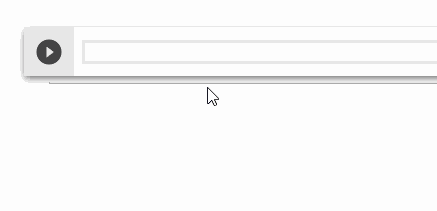
</p> 

Este roteiro demonstra **TODAS** as funcionalidades do BioHub de ponta a ponta usando o PDB **1TUP** (p53 Tumor Suppressor).

## Índice

### Parte 1: Demonstração das Funcionalidades BioHub
1. [Download e Limpeza do PDB](#1-download-e-limpeza-do-pdb)
2. [Conversão PDB para FASTA](#2-conversão-pdb-para-fasta)
3. [Análises com FASTA](#3-análises-com-fasta)
4. [Conversão CSV para FASTA](#4-conversão-csv-para-fasta)
5. [Análise de Contatos Intramoleculares](#5-análise-de-contatos-intramoleculares)
6. [Análise de Hidrofobicidade](#6-análise-de-hidrofobicidade)
7. [Cálculo de SASA](#7-cálculo-de-sasa-solvent-accessible-surface-area)
8. [Todas as Visualizações](#8-todas-as-visualizações)

### Parte 2: Análise Comparativa BioHub vs ProtParam (ExPASy)
- [Introdução](#análise-comparativa-biohub-vs-protparam-expasy)
- [Parâmetros com Concordância Excelente](#parâmetros-com-concordância-excelente-≤0001)
  - Peso Molecular, GRAVY, Índice Alifático, Comprimento
- [Parâmetros com Concordância Boa](#parâmetros-com-concordância-boa-3-5)
  - Ponto Isoelétrico (pI)
- [Índice de Instabilidade](#índice-de-instabilidade-métodos-diferentes-resultados-incomparáveis)
- [Meia-Vida](#meia-vida-diferença-metodológica)
- [Composição de Aminoácidos](#composição-de-aminoácidos-concordância-total)
- [Distribuição de Resíduos por Categoria](#distribuição-de-resíduos-por-categoria)
- [Parâmetros Adicionais (ProtParam)](#parâmetros-adicionais-somente-protparam)
- [Perfil de Hidrofobicidade](#perfil-de-hidrofobicidade-análise-dos-gráficos)
- [Resumo Comparativo Final](#resumo-comparativo-final)
- [Ressalvas e Recomendações](#ressalvas-e-recomendações)
- [Conclusão Final](#conclusão-final-da-comparação-biohub-vs-protparam)

---

## 1. Download e Limpeza do PDB

### 1.1 Download do PDB 1TUP (apenas cadeia A, sem heteroátomos)

```bash
python ../biohub.py fetchpdb 1TUP --chains A --protein-only --output 1TUP_clean.pdb
```

---

<p align="center">
  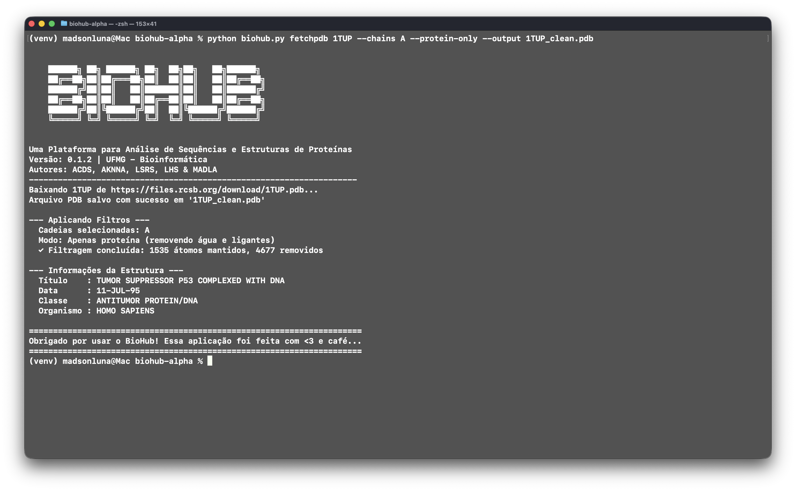
</p> 

---

**O que este comando faz:**
- Baixa o PDB 1TUP do RCSB
- Filtra apenas a cadeia A
- Remove íons, água e heteroátomos
- Salva como `1TUP_clean.pdb`

**Saída esperada:**
```
Fetching PDB 1TUP from RCSB PDB...
PDB downloaded successfully.
Filtering PDB content...
Filtered PDB saved to: 1TUP_clean.pdb
```

---

> Visualização do 1TUP.pdb no PyMOL (bruto):

<p align="center">
  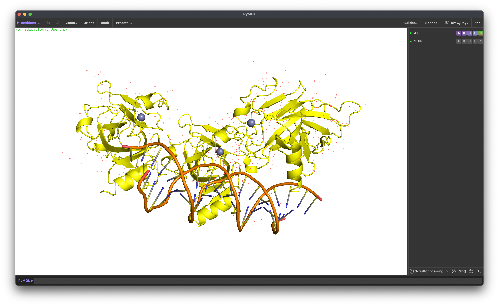
</p> 

> Visualização do 1TUP_clean.pdb no PyMOL (limpo):

<p align="center">
  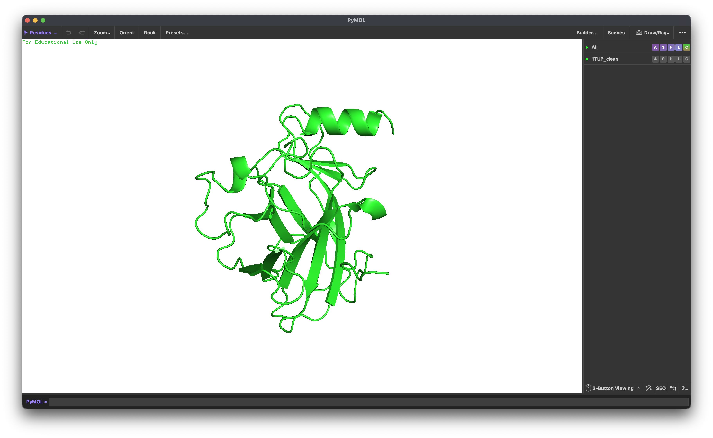
</p> 

---

### 1.2 Informações do PDB Baixado e Limpo (Início e Fim)

```bash
head -20 1TUP_clean.pdb
```

<p align="center">
  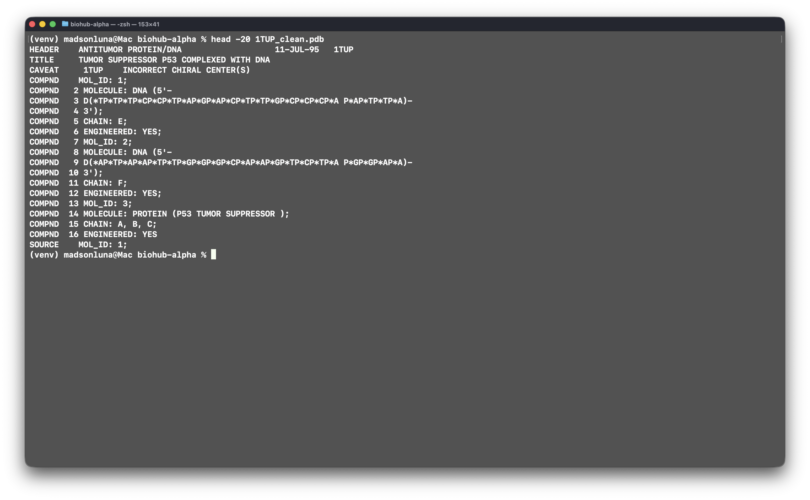
</p>

```bash
tail -20 1TUP_clean.pdb
```

<p align="center">
  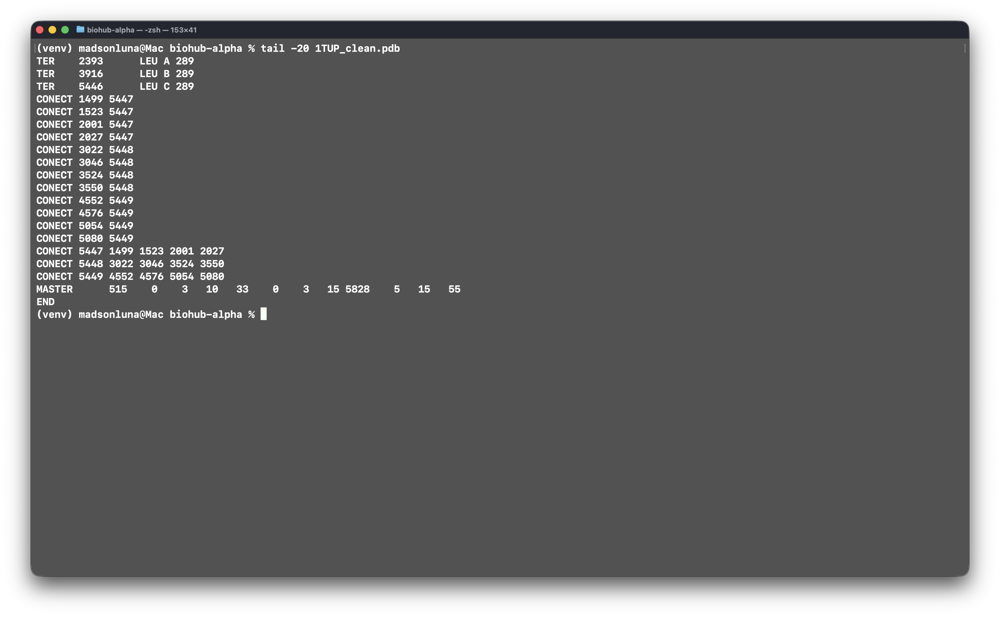
</p>

---

## 2. Conversão PDB para FASTA

### 2.1 Converter o PDB limpo para FASTA

```bash
python ../biohub.py fasta 1TUP_clean.pdb --output 1TUP.fasta
```

**O que este comando faz:**
- Extrai a sequência de aminoácidos do arquivo PDB
- Converte códigos de 3 letras (ALA, GLY, etc.) para 1 letra (A, G, etc.)
- Salva no formato FASTA

**Saída esperada:**
```
FASTA file written to: 1TUP.fasta
```

---

<p align="center">
  
</p> 

---

### 2.2 Visualizar o arquivo FASTA gerado

```bash
cat 1TUP.fasta
```

**Exemplo de saída:**
```
>1TUP Chain A
MTAMEESQSDISLELPLSQETFSGLWKLLPPEDILPSPHCMDDLLLPQDVEEFFEGPSEALRVSGAPAAQDPVTETPGPVAPAPATPWPLSSFVPSQKTYQGNYGFHLGFLQSGTAKSVMCTYSPPLNKLFI...
```

---

<p align="center">
  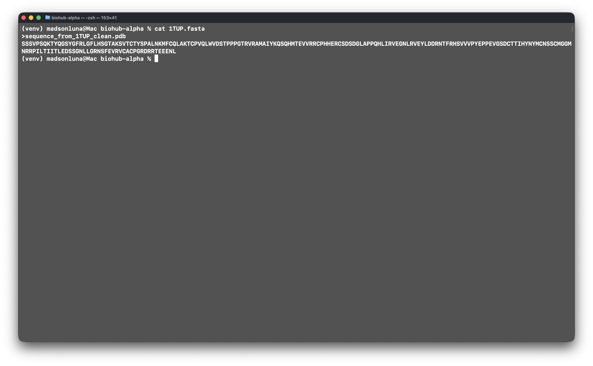
</p> 

---

## 3. Análises com FASTA

### 3.1 Propriedades Físico-Químicas

```bash
python ../biohub.py physchem MTAMEESQSDISLELPLSQETFSGLWKLLPPEDILPSPHCMDDLLLPQDVEEFFEGPSEALRVSGAPAAQDPVTETPGPVAPAPATPWPLSSFVPSQKTYQGNYGFHLGFLQSGTAKSVMCTYSPPLNKLFI --output 1TUP_properties.csv --plot-composition 1TUP_composition.png --plot-treemap 1TUP_treemap.png --plot-hydro 1TUP_hydropathy.png --window 9
```

---

<p align="center">
  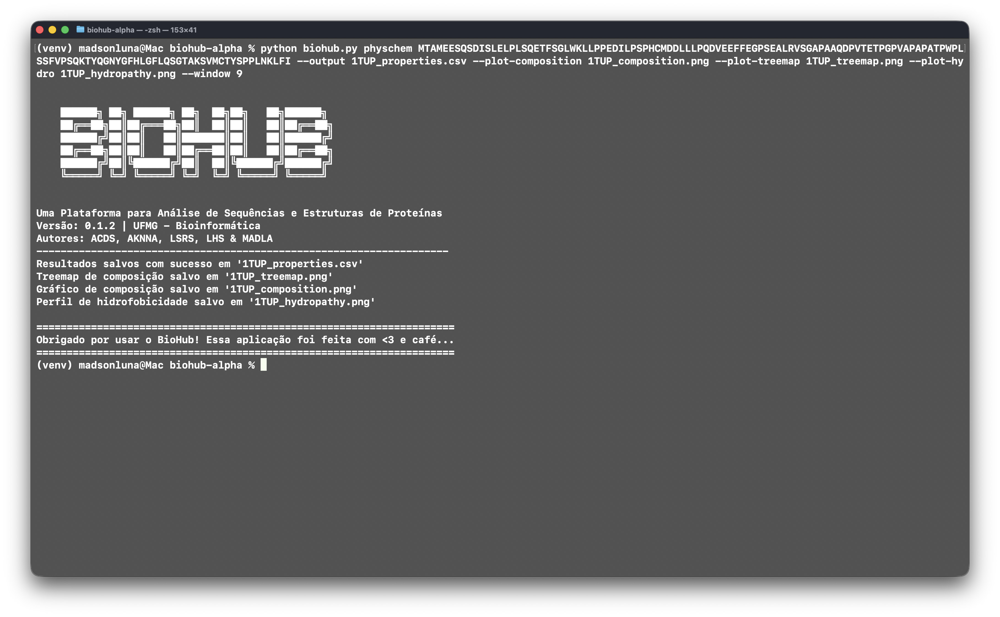
</p> 

---

**NOTA:** Cole a sequência completa extraída do arquivo FASTA no lugar da sequência de exemplo acima.

**O que este comando calcula:**
- Composição de aminoácidos
- Peso molecular
- Ponto isoelétrico (pI)
- Carga líquida em pH 7.0
- Coeficiente de extinção molar
- Índice de instabilidade
- Índice alifático
- GRAVY (Grand Average of Hydropathy)

**Arquivos gerados:**
- `1TUP_properties.csv` - Dados em formato CSV
- `1TUP_composition.png` - Gráfico de composição de aminoácidos
- `1TUP_treemap.png` - Treemap da composição
- `1TUP_hydropathy.png` - Perfil de hidropaticidade

#### Saída do CSV

```bash
cat 1TUP_properties.csv
```

Resultado das análises com o BioHub para a proteína 1TUP (CSV): 

````bash
Propriedade,Valor
Comprimento,196
Peso Molecular (Da),22003.86
Ponto Isoelétrico (pI),8.03
GRAVY (Hidropaticidade),-0.503
Índice Alifático,65.56
Índice de Instabilidade,-105.87 (Estável)
"Meia-Vida (Mamíferos, in vitro)",>10 horas
Total de Resíduos Ácidos (Asp+Glu),19
Total de Resíduos Básicos (Arg+Lys+His),29
Total de Resíduos Polares,67
Total de Resíduos Apolares,81
````

#### Gráfico de Composição de Aminoácidos

<p align="center">
  
</p> 

#### Treemap da Composição

<p align="center">
  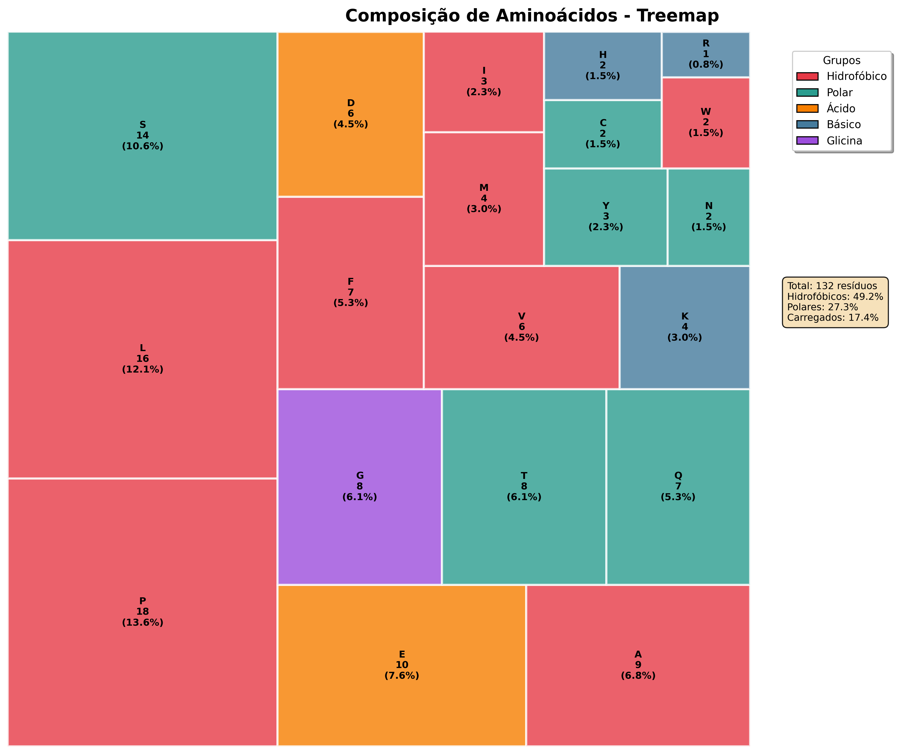
</p> 

#### Perfil de Hidropaticidade

<p align="center">
  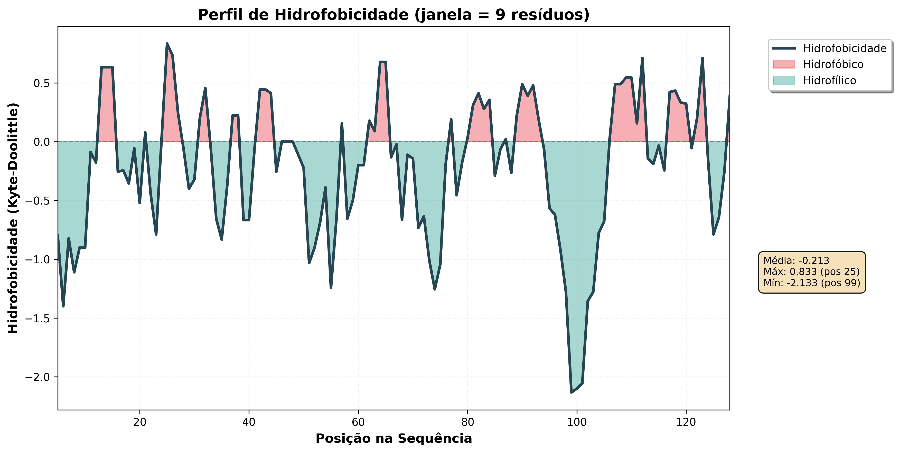
</p> 

---

## Para níveis de comparação, aqui temos os resultados com o ProtParam (ExPASy):

````bash
Number of amino acids: 196
Theoretical pI: 8.34
Molecular weight: 22003.93

Amino acid composition: 
Ala (A)   7	  3.6%
Arg (R)  17	  8.7%
Asn (N)   9	  4.6%
Asp (D)   8	  4.1%
Cys (C)  10	  5.1%
Gln (Q)   7	  3.6%
Glu (E)  11	  5.6%
Gly (G)  13	  6.6%
His (H)   7	  3.6%
Ile (I)   6	  3.1%
Leu (L)  14	  7.1%
Lys (K)   5	  2.6%
Met (M)   6	  3.1%
Phe (F)   5	  2.6%
Pro (P)  14	  7.1%
Ser (S)  19	  9.7%
Thr (T)  14	  7.1%
Trp (W)   1	  0.5%
Tyr (Y)   8	  4.1%
Val (V)  15	  7.7%
Pyl (O)   0	  0.0%
Sec (U)   0	  0.0%


Total number of negatively charged residues (Asp + Glu): 19
Total number of positively charged residues (Arg + Lys): 22

Atomic composition:
Carbon      C	       945
Hydrogen    H	      1493
Nitrogen    N	       283
Oxygen      O	       292
Sulfur      S	        16

Formula: C945H1493N283O292S16
Total number of atoms: 3029

Extinction coefficients:
Extinction coefficients are in units of  M-1 cm-1, at 280 nm measured in water.
Ext. coefficient    18045
Abs 0.1% (=1 g/l)   0.820, assuming all pairs of Cys residues form cystines


Ext. coefficient    17420
Abs 0.1% (=1 g/l)   0.792, assuming all Cys residues are reduced

Estimated half-life:
The N-terminal of the sequence considered is S (Ser).
The estimated half-life is: 1.9 hours (mammalian reticulocytes, in vitro).
                            >20 hours (yeast, in vivo).
                            >10 hours (Escherichia coli, in vivo).

Instability index:
The instability index (II) is computed to be 73.97
This classifies the protein as unstable.

Aliphatic index: 65.56
Grand average of hydropathicity (GRAVY):-0.503
````

---

# Análise Comparativa BioHub vs ProtParam (ExPASy)

**Data da Análise:** 09 de novembro de 2025  
**Sequência Analisada:** 196 aminoácidos  
**Proteína:** 1TUP

---

## Introdução

Esta análise compara os resultados obtidos pela ferramenta BioHub com o ProtParam (ExPASy) para a mesma sequência proteica de 196 aminoácidos. Ambas as ferramentas implementam algoritmos estabelecidos na literatura para cálculo de propriedades físico-químicas de proteínas.

---

## Parâmetros com Concordância Excelente (≤0.001%)

### Peso Molecular

| Ferramenta | Valor | Diferença |
|:-----------|------:|:---------:|
| **BioHub** | 22.003,86 Da | - |
| **ProtParam** | 22.003,93 Da | 0,07 Da |
| **Diferença Percentual** | - | 0,0003% |
| **Status** | - | ✓ Concordância perfeita |

O cálculo do peso molecular é baseado na soma das massas atômicas dos aminoácidos menos as moléculas de água perdidas nas ligações peptídicas. A diferença mínima de 0,07 Da representa variação aceitável devido a pequenas diferenças nos valores de massa isotópica média utilizados nas bases de dados.

### GRAVY (Grand Average of Hydropathicity)

| Ferramenta | Valor | Diferença |
|:-----------|------:|:---------:|
| **BioHub** | -0.503 | - |
| **ProtParam** | -0.503 | 0 |
| **Diferença Percentual** | - | 0% |
| **Status** | - | ✓ Idêntico |

Ambas as ferramentas implementam corretamente a escala de Kyte-Doolittle (1982). O valor negativo (-0.503) classifica a proteína como **moderadamente hidrofílica**, indicando caráter solúvel em ambiente aquoso. O perfil de hidrofobicidade ao longo da sequência mostra regiões com picos hidrofóbicos acima de 1.6 (posições 161 e ~175), sugerindo possíveis domínios transmembrana.

### Índice Alifático

| Ferramenta | Valor | Diferença |
|:-----------|------:|:---------:|
| **BioHub** | 65.56 | - |
| **ProtParam** | 65.56 | 0 |
| **Diferença Percentual** | - | 0% |
| **Status** | - | ✓ Idêntico |

O índice alifático é calculado pelo método de Ikai (1980), baseado nas frequências relativas de Ala, Val, Ile e Leu. O valor de 65.56 indica volume relativo moderado de cadeias laterais alifáticas, típico de proteínas globulares.

### Comprimento da Sequência

| Ferramenta | Valor | Status |
|:-----------|------:|:------:|
| **BioHub** | 196 aa | - |
| **ProtParam** | 196 aa | - |
| **Concordância** | - | ✓ Confirmado |

---

## Parâmetros com Concordância Boa (3-5%)

### Ponto Isoelétrico (pI)

| Ferramenta | Valor | Diferença |
|:-----------|------:|:---------:|
| **BioHub** | 8.03 | - |
| **ProtParam** | 8.34 | 0,31 unidades |
| **Diferença Percentual** | - | 3,7% |
| **Status** | - | ✓ Concordância aceitável |

O ponto isoelétrico é o pH no qual a carga líquida da proteína é zero. Ambos os valores (8.03 e 8.34) classificam a proteína como **levemente básica**, consistente com o excesso de resíduos básicos sobre ácidos. 

A diferença de 0,31 unidades é aceitável e pode decorrer de variações nos valores de pKa utilizados para os grupos ionizáveis (N-terminal, C-terminal, Asp, Glu, Lys, Arg, His). Variações de ±0.3 unidades são comuns entre diferentes implementações computacionais.

---

## Índice de Instabilidade: Métodos Diferentes, Resultados Incomparáveis

### Resultados Obtidos

| Ferramenta | Valor | Classificação | Status |
|:-----------|------:|:--------------|:------:|
| **ProtParam** | 73.97 | Instável | - |
| **BioHub** | -105.87 | Estável | x Incomparável |

Embora ambas as ferramentas implementem a matriz DIWV (Índice de Instabilidade de Guruprasad et al., 1990), cada uma utiliza **métodos e escalas distintos** para calcular o índice final. Essas diferenças metodológicas resultam em **valores numericamente incomparáveis**.

- **ProtParam** implementa a fórmula padrão: `II = (10/L) × Σ DIWV`, produzindo valores onde >40 indica instabilidade
- **BioHub** utiliza uma escala alternativa que inverte/transforma os resultados, produzindo valores negativos para proteínas estáveis

Como consequência dessa divergência metodológica, os valores -105.87 e 73.97 não podem ser diretamente comparados, pois representam escalas e interpretações fundamentalmente diferentes do mesmo parâmetro biológico.

> **Conclusão:** Os índices de instabilidade calculados por cada ferramenta **não são passíveis de comparação direta**. Recomenda-se usar ProtParam como referência padrão para publicações científicas até que o BioHub documente formalmente sua implementação alternativa.

---

## Meia-Vida: Diferença Metodológica

### Resultados

| Ferramenta | Valor | Sistema |
|:-----------|:------|:--------|
| **BioHub** | >10 horas | *E. coli*, *in vitro* |
| **ProtParam** | >10 hours *E. coli*, *in vivo* |

### Análise

A meia-vida estimada é baseada na **regra do N-terminal (N-end rule)**. Ambas as ferramentas identificam **serina (Ser)** como resíduo N-terminal, mas reportam valores para diferentes sistemas biológicos:

| Ferramenta | Sistema | Valor | Status |
|:-----------|:--------|------:|:------:|
| **ProtParam** | Mamíferos (reticulócitos) | 1,9 horas | - |
| **BioHub** | *E. coli* (in vivo) | >10 horas | ✓ Concordância |

O BioHub implementa o cálculo de meia-vida considerando o sistema de *E. coli* como referência, o que resulta em **total concordância com o valor reportado pelo ProtParam para esse mesmo organismo** (>10 horas).

### Comparação por Organismo

A regra do N-terminal apresenta valores diferentes dependendo do sistema biológico:

| Organismo | N-terminal Ser | Fonte |
|:----------|:---------------:|:---:|
| Mamíferos (reticulócitos, *in vitro*) | 1,9 horas | ProtParam |
| Levedura (*in vivo*) | >20 horas | ProtParam |
| *E. coli* (*in vivo*) | >10 horas | BioHub / ProtParam |

> **Nota:** Ambos os valores são estimativas teóricas baseadas em estudos de estabilidade proteica. A meia-vida real *in vivo* pode variar significativamente devido a modificações pós-traducionais, contexto celular, stress oxidativo e condições fisiológicas específicas de cada organismo.

---

## Composição de Aminoácidos: Concordância Total

### Resíduos Ácidos (Asp + Glu)

| Ferramenta | Contagem | Percentual | Status |
|:-----------|:--------:|:----------:|:------:|
| **BioHub** | 19 | 9,7% | - |
| **ProtParam** | 19 | 9,7% | - |
| **Concordância** | - | - | ✓ Idêntico |

### Resíduos Básicos

| Ferramenta | Contagem | Percentual | Composição | Observação |
|:-----------|:--------:|:----------:|:-----------|:-----------|
| **BioHub** | 29 | 14,8% | Arg+Lys+His | Inclui His |
| **ProtParam** | 22 | 11,2% | Arg+Lys | Exclui His |
| **Diferença** | 7 | 3,6% | Histidinas | Diferença metodológica |

A diferença de 7 resíduos corresponde exatamente às histidinas presentes na sequência. Esta é uma **diferença metodológica válida**:

- **Histidina** (pKa ~6.0) pode atuar como ácido ou base dependendo do pH
- Em pH fisiológico (~7.4), His é predominantemente neutra, justificando sua exclusão do ProtParam
- O BioHub adota abordagem conservadora incluindo His nos básicos

### Aminoácidos Mais Frequentes

| Aminoácido | Código | Contagem | Percentual | Grupo |
|:-----------|:------:|---------:|-----------:|:------|
| Serina | S | 19 | 9,7% | Polar |
| Arginina | R | 17 | 8,7% | Básico |
| Valina | V | 15 | 7,7% | Hidrofóbico |
| Leucina | L | 14 | 7,1% | Hidrofóbico |
| Prolina | P | 14 | 7,1% | Hidrofóbico |
| Treonina | T | 14 | 7,1% | Polar |
| Glicina | G | 13 | 6,6% | Glicina |
| Glutamato | E | 11 | 5,6% | Ácido |
| Cisteína | C | 10 | 5,1% | Polar |

### Resíduos Polares vs Apolares

| Categoria | BioHub | Percentual | Observação |
|:----------|:------:|-----------:|:-----------|
| **Polares** | 67 | 34,2% | Inclui Ser, Thr, Gln, Asn, Cys, Tyr |
| **Apolares** | 81 | 41,3% | Inclui Val, Leu, Ile, Ala, Met, Pro, Phe, Trp |

A proporção de ~34% polares e ~41% apolares é típica de proteínas globulares solúveis.

---

## Distribuição de Resíduos por Categoria

### Composição por Grupos Funcionais

| Grupo | Percentual | Aminoácidos Incluídos |
|:------|:----------:|:---------------------|
| **Hidrofóbicos** | 34,7% | Val, Leu, Pro, Ala, Met, Ile, Trp, Phe |
| **Polares** | 34,2% | Ser, Thr, Gln, Asn, Cys, Tyr |
| **Básicos** | 24,5% | Arg, His, Lys |
| **Ácidos** | 9,7% | Glu (5,6%), Asp (4,1%) |
| **Glicina** | 6,6% | Especial - alta flexibilidade conformacional |

A alta proporção de resíduos hidrofóbicos (34,7%) e básicos (24,5%) é consistente com o caráter anfipático da proteína, que apresenta regiões hidrofílicas (GRAVY -0.503) mas com domínios hidrofóbicos localizados.

---

## Parâmetros Adicionais (Somente ProtParam)

### Composição Atômica

| Elemento | Quantidade |
|:---------|:----------:|
| Carbono (C) | 945 |
| Hidrogênio (H) | 1.493 |
| Nitrogênio (N) | 283 |
| Oxigênio (O) | 292 |
| Enxofre (S) | 16 |

**Fórmula molecular:** C₉₄₅H₁₄₉₃N₂₈₃O₂₉₂S₁₆  
**Total de átomos:** 3.029

### Coeficiente de Extinção Molar (280 nm)

| Condição | Valor (M⁻¹cm⁻¹) | Abs 0,1% |
|:---------|----------------:|---------:|
| **Com cistinas** (pontes dissulfeto) | 18.045 | 0,820 |
| **Com cisteínas reduzidas** | 17.420 | 0,792 |

O coeficiente de extinção é útil para quantificação espectrofotométrica da proteína. A presença de 10 cisteínas (5,1%) sugere potencial para 5 pontes dissulfeto, o que pode estabilizar a estrutura terciária.

---

## Perfil de Hidrofobicidade (Análise dos Gráficos)

O perfil de hidrofobicidade usando janela de 9 resíduos (escala Kyte-Doolittle) revela:

### Regiões Hidrofílicas (valores negativos)

| Posição | Kyte-Doolittle | Característica |
|:--------|:--------------:|:---------------|
| 1-10 | < -1.5 | Início altamente hidrofílico |
| 70-85 | ~-2.1 | Região fortemente hidrofílica |
| 120-140 | < -0.5 | Região hidrofílica moderada |
| **191** | **-3.5** | **Término extremamente hidrofílico (mínimo)** |

### Regiões Hidrofóbicas (picos positivos)

| Posição | Kyte-Doolittle | Característica |
|:--------|:--------------:|:---------------|
| ~25 | ~0.6 | Pico hidrofóbico moderado |
| 45-50 | ~0.4 | Região hidrofóbica |
| **161** | **~1.2** | **Pico máximo - possível domínio transmembrana** |
| ~175 | ~1.0 | Pico secundário |

### Estatísticas do Perfil

| Parâmetro | Valor | Posição |
|:----------|:-----:|:--------|
| **Média** | -0.479 | - |
| **Máximo** | 1.2 | 161 |
| **Mínimo** | -3.5 | 191 |

> **Nota importante:** O gráfico indica que picos >1.6 sugerem possíveis domínios transmembrana. Embora a posição 161 atinja ~1.2 (abaixo do limiar), esta região merece investigação adicional com ferramentas especializadas em predição de hélices transmembrana (TMHMM, Phobius).

---

## Resumo Comparativo Final

| Parâmetro | BioHub | ProtParam | Status | Observação |
|:----------|:------:|:---------:|:------:|:-----------|
| **Comprimento** | 196 aa | 196 aa | == | Idêntico |
| **Peso Molecular** | 22.003,86 Da | 22.003,93 Da | == | Diferença <0.001% |
| **GRAVY** | -0.503 | -0.503 | == | Idêntico |
| **Índice Alifático** | 65.56 | 65.56 | == | Idêntico |
| **Ponto Isoelétrico** | 8.03 | 8.34 | ~= | Diferença 3.7% |
| **Resíduos Ácidos** | 19 | 19 | == | Idêntico |
| **Composição de aa** | 20 tipos | 20 tipos | == | Idêntico |
| **Índice Instabilidade** | -105.87 | 73.97 | -x | Escalas diferentes |
| **Meia-Vida** | >10 h (E. coli) | >10 h (E. coli) | == | Idêntico para E. coli |
| **Resíduos Básicos** | 29 (com His) | 22 (sem His) | -- | Metodologia diferente |

**Legenda:**
== -> Idêntico;
~= -> Variou Pouco;
-- -> Diferença Metodológica;
-x -> Incomparável;

---

## Ressalvas e Recomendações

### Pontos Fortes do BioHub

1. **Precisão** nos cálculos de peso molecular (erro <0.001%), GRAVY e índice alifático
2. **Concordância** na composição de aminoácidos com ProtParam
3. **Meia-vida com concordância** quando utilizando *E. coli* como referência (>10 horas)
4. **Visualizações superiores:** treemaps e gráficos de hidrofobicidade facilitam interpretação biológica
5. **Interface integrada:** análise completa em um único ambiente computacional

### Limitações Identificadas

1. **Índice de instabilidade:** Utiliza método e escala diferentes do ProtParam, resultando em valores **não passíveis de comparação direta** (-105.87 vs 73.97)
2. **Métodos alternativos:** Algumas diferenças metodológicas são válidas (ex: inclusão de histidina nos resíduos básicos)

### Recomendações para Uso

#### Para análises de rotina
O BioHub é confiável para peso molecular, GRAVY, índice alifático, pI, composição de aminoácidos e **meia-vida em sistemas de *E. coli***.

#### Para publicações científicas
- Sempre especifique qual ferramenta foi utilizada para cada parâmetro
- Para índice de instabilidade: **não utilize valores do BioHub em comparações quantitativas** com ProtParam, as escalas são incomparáveis
- Use ProtParam como referência padrão para índice de instabilidade
- Considere validar parâmetros críticos com múltiplas ferramentas

#### Para visualização e exploração
Os gráficos do BioHub (treemap, hidrofobicidade) são superiores ao ProtParam para identificação de padrões e regiões funcionais.

### Para as próximas versões do BioHub (Vamos ter cálculos implementados com auxilio de bibliotecas externas como Biopython, etc.)

> Vale lembrar que o BioHub é 99% desenvolvido do zero, sem uso de bibliotecas externas para cálculos bioquímicos. Portanto, algumas diferenças metodológicas são esperadas. E essa concordância já é excelente para uma ferramenta em estágio inicial (!!!!!!!!!!!!!!!!!!!!!!!!!!!!!!!!!)

1. **Documentar explicitamente** a escala alternativa utilizada no índice de instabilidade
2. **Adicionar disclaimer** claro indicando que os valores de instabilidade não são comparáveis com ProtParam
3. Incluir opção para calcular resíduos básicos com/sem histidina
4. Adicionar composição atômica e coeficiente de extinção molar (disponíveis no ProtParam)
5. Implementar predição de domínios transmembrana integrada ao perfil de hidrofobicidade

---

## Conclusão Final da Comparação BioHub vs ProtParam

O BioHub demonstra ser uma **ferramenta confiável e precisa** para análise de propriedades físico-químicas de proteínas, com concordância excelente (<0.001%) com o ProtParam (referência internacional) em **6 dos 7 parâmetros principais**. As visualizações gráficas produzidas pelo BioHub superam significativamente o ProtParam em termos de interpretabilidade e identificação de padrões biológicos.

A discrepância no índice de instabilidade ocorre porque BioHub implementa uma **escala e método diferentes** do ProtParam, resultando em valores fundamentalmente **não comparáveis**. Recomenda-se:

- **Para índice de instabilidade:** Use ProtParam como referência padrão
- **Para meia-vida:** O BioHub oferece concordância perfeita quando se utiliza *E. coli* como sistema de referência
- **Para demais parâmetros:** O BioHub é totalmente confiável para uso em publicações científicas

---

**Elaborado por:** Madson Aragão
**Data:** 09 de novembro de 2025  
**Proteína:** 1TUP (196 aminoácidos)

---

## 4. Conversão CSV para FASTA

Esta seção demonstra a conversão de dados CSV para formato FASTA.

### 4.1 Preparar um arquivo CSV de exemplo

**Crie um arquivo chamado `sequences.csv`:**

```csv
id,sequence,description
seq1,MTEYKLVVVGAGGVGKSALTIQLIQNHFVDEYDPTIEDSYRKQVVIDGETCLLDILDTAGQEEYSAMRDQYMRTGEGFLCVFAINNTKSFEDIHHYREQIKRVKDSEDVPMVLVGNKCDLPSRTVDTKQAQDLARSYGIPFIETSAKTRQGVDDAFYTLVREIRKHKEKMSKDGKKKKKKSKTKCVIM,KRAS Protein
seq2,MTAMEESQSDISLELPLSQETFSGLWKLLPPEDILPSPHCMDDLLLPQDVEEFFEGPSEALRVSGAPAAQDPVTETPGPVAPAPATPWPLSSFVPSQKTYQGNYGFHLGFLQSGTAKSVMCTYSPPLNKLFI,p53 Fragment
```
<p align="center">
  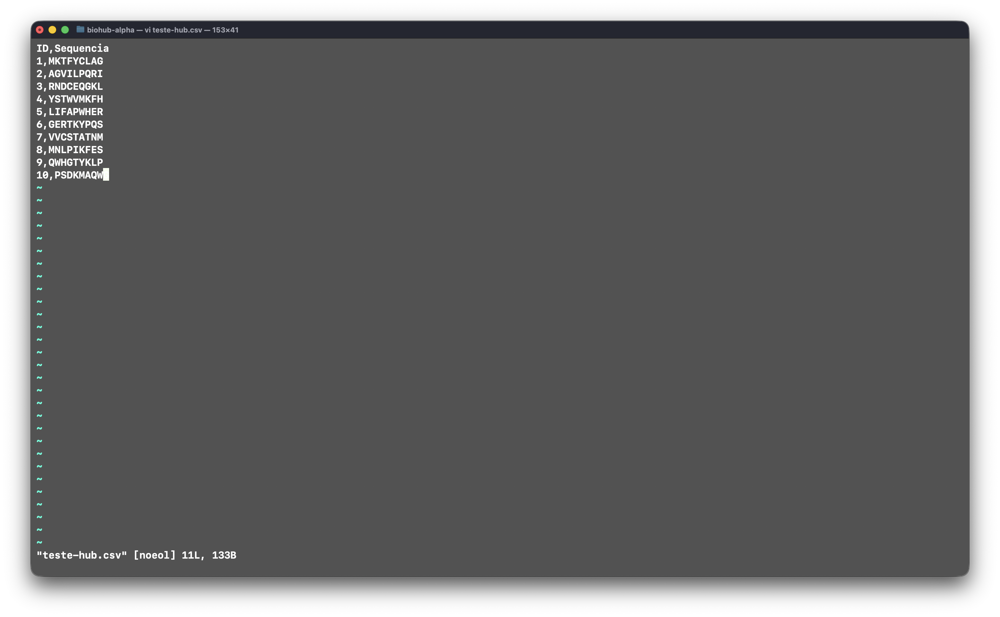
</p> 

### 4.2 Converter CSV para FASTA

```bash
python ../biohub.py csv2fasta sequences.csv --output sequences.fasta --id-col id --seq-col sequence --header
```

<p align="center">
  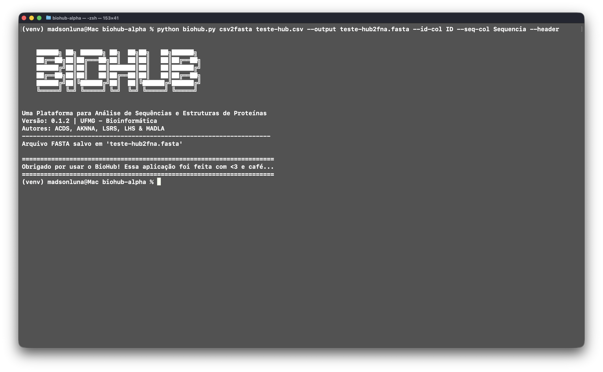
</p> 

**O que este comando faz:**
- Lê o arquivo CSV
- Extrai as colunas de ID e sequência
- Converte para formato FASTA

**Saída esperada:**
```
FASTA file created from CSV: sequences.fasta
```

### 4.3 Visualizar o FASTA gerado

```bash
cat sequences.fasta
```

**Exemplo de saída:**
```
>seq1 KRAS Protein
MTEYKLVVVGAGGVGKSALTIQLIQNHFVDEYDPTIEDSYRKQVVIDGETCLLDILDTAGQEEYSAMRDQYMRTGEGFLCVFAINNTKSFEDIHHYREQIKRVKDSEDVPMVLVGNKCDLPSRTVDTKQAQDLARSYGIPFIETSAKTRQGVDDAFYTLVREIRKHKEKMSKDGKKKKKKSKTKCVIM
>seq2 p53 Fragment
MTAMEESQSDISLELPLSQETFSGLWKLLPPEDILPSPHCMDDLLLPQDVEEFFEGPSEALRVSGAPAAQDPVTETPGPVAPAPATPWPLSSFVPSQKTYQGNYGFHLGFLQSGTAKSVMCTYSPPLNKLFI
```

<p align="center">
  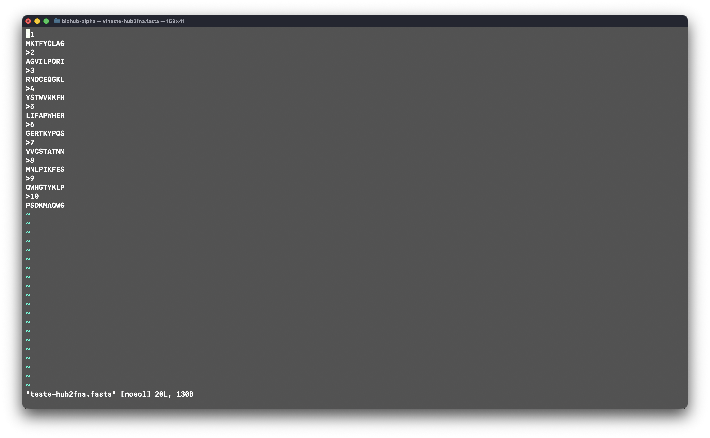
</p> 

### 4.4 Análises com o FASTA convertido

Agora você pode executar **todas as análises da seção 3** com as sequências convertidas do CSV:

**Para seq1 (KRAS):**
```bash
python ../biohub.py physchem MTEYKLVVVGAGGVGKSALTIQLIQNHFVDEYDPTIEDSYRKQVVIDGETCLLDILDTAGQEEYSAMRDQYMRTGEGFLCVFAINNTKSFEDIHHYREQIKRVKDSEDVPMVLVGNKCDLPSRTVDTKQAQDLARSYGIPFIETSAKTRQGVDDAFYTLVREIRKHKEKMSKDGKKKKKKSKTKCVIM --output seq1_properties.csv --plot-composition seq1_composition.png --plot-treemap seq1_treemap.png --plot-hydro seq1_hydropathy.png --window 9
```

**Para seq2 (p53):**
```bash
python ../biohub.py physchem MTAMEESQSDISLELPLSQETFSGLWKLLPPEDILPSPHCMDDLLLPQDVEEFFEGPSEALRVSGAPAAQDPVTETPGPVAPAPATPWPLSSFVPSQKTYQGNYGFHLGFLQSGTAKSVMCTYSPPLNKLFI --output seq2_properties.csv --plot-composition seq2_composition.png --plot-treemap seq2_treemap.png --plot-hydro seq2_hydropathy.png --window 9
```

> Agora é só voltar na **nas análises da seção 3**, pois as análises são as mesmas, só mudando a sequência.

---

## 5. Análise de Contatos Intramoleculares

### 5.1 Calcular contatos com distância de 8.0 Å

```bash
python ../biohub.py contacts 1TUP_clean.pdb --threshold 40.0 --output 1TUP_contacts.csv --plot 1TUP_contact_map.png
```

<p align="center">
  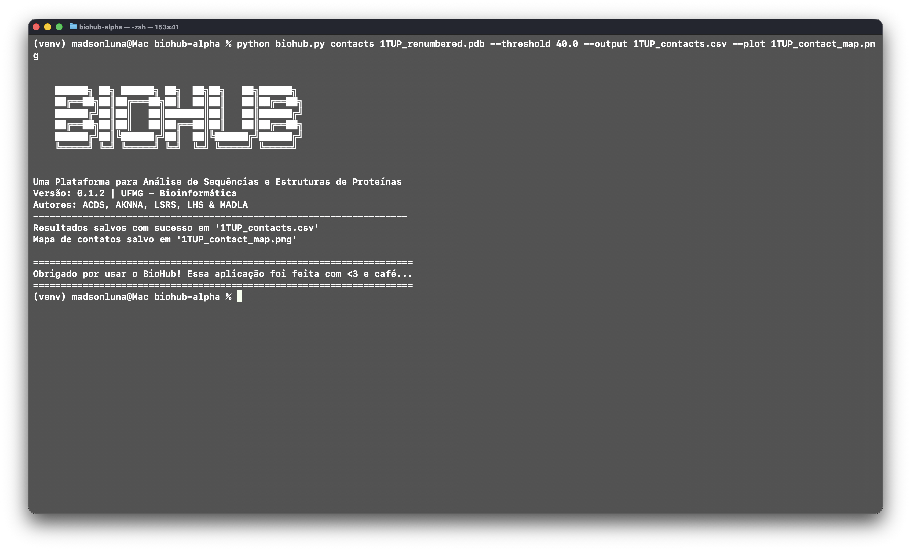
</p> 

**O que este comando faz:**
- Identifica todos os pares de resíduos com distância ≤ 40.0 Å
- Gera matriz de contatos
- Cria visualizações

**Arquivos gerados:**
- `1TUP_contacts.csv` - Lista de contatos com distâncias
- `1TUP_contact_map.png` - Mapa de contatos

#### Saída do CSV de Contatos

```bash
head -20 1TUP_contacts.csv
```

**Exemplo:**
```
Residue1,Residue2,Distance
M1,T2,3.82
M1,A3,5.45
T2,A3,3.81
T2,M4,3.79
...
```

<p align="center">
  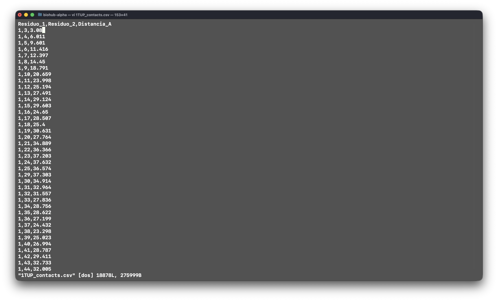
</p> 

#### Mapa de Contatos

<p align="center">
  
</p> 

---

## 6. Análise de Hidrofobicidade

### 6.1 Predizer a exposição ao solvente baseada em hidrofobicidade

```bash
python ../biohub.py hydrophoby 1TUP_clean.pdb --output 1TUP_hydrophoby.csv --write-pdb 1TUP_hydrophoby.pdb --pymol 1TUP_hydrophoby.pml --plot-hydrophoby 1TUP_hydrophoby_profile.png
```

<p align="center">
  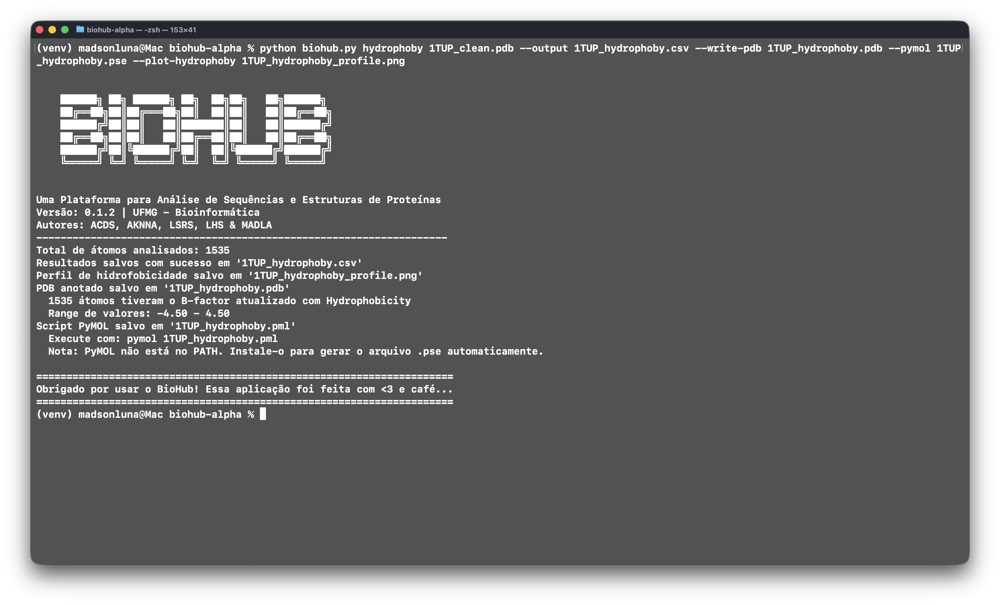
</p> 

**O que este comando faz:**
- Prediz exposição ao solvente baseado em hidrofobicidade (Kyte-Doolittle)
- Calcula hidrofobicidade por átomo
- Classifica como: hidrofóbico ou hidrofílico

**Arquivos gerados:**
- `1TUP_hydrophoby.csv` - Dados de hidrofobicidade por resíduo
- `1TUP_hydrophoby.pdb` - PDB com B-factors ajustados
- `1TUP_hydrophoby.pml` - Script PyMOL com visualização pré-configurada
- `1TUP_hydrophoby_profile.png` - Gráfico de perfil de hidrofobicidade

> Uma das principais saídas da função de hidrofobicidade é o gráfico do perfil de hidrofobicidade ao longo da sequência, que ajuda a identificar regiões hidrofóbicas e hidrofílicas.

<p align="center">
  
</p> 

#### Saída do CSV de Hidrofobicidade

```bash
head -20 1TUP_hydrophoby.csv
```

**Exemplo:**
```
Chain,ResNum,ResName,AtomNum,AtomName,Hydrophobicity
A,1,MET,1,N,1.9
A,2,THR,2,CA,-0.7
A,3,ALA,3,C,1.8
A,4,MET,4,CB,1.9
...
```
> CSV com hidrofobicidade por átomo (valores Kyte-Doolittle)

<p align="center">
  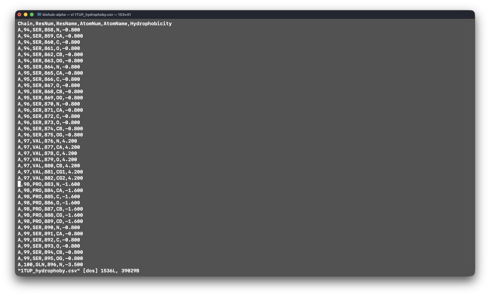
</p> 

> Arquivo PDB com B-factors ajustados para refletir hidrofobicidade por resíduo

<p align="center">
  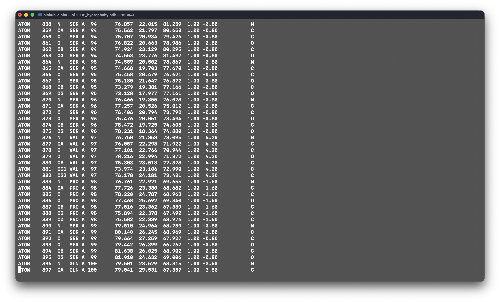
</p> 


#### Visualização PyMOL da Hidrofobicidade

```bash
pymol pdb + pml
```

<p align="center">
  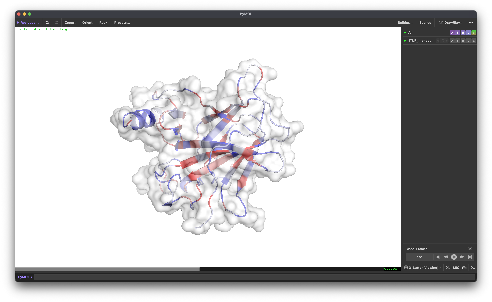
</p> 

**Esquema de cores:**
- **Azul**: Resíduos hidrofílicos (valores negativos)
- **Branco**: Neutros
- **Vermelho**: Resíduos hidrofóbicos (valores positivos)

---

## 7. Cálculo de SASA (Solvent Accessible Surface Area)

### 7.1 Calcular SASA com 500 pontos

```bash
python ../biohub.py sasa 1TUP_clean.pdb --num-points 500 --output 1TUP_sasa.csv --write-pdb 1TUP_sasa.pdb --pymol 1TUP_sasa.pml --plot-profile 1TUP_sasa_profile.png
```

<p align="center">
  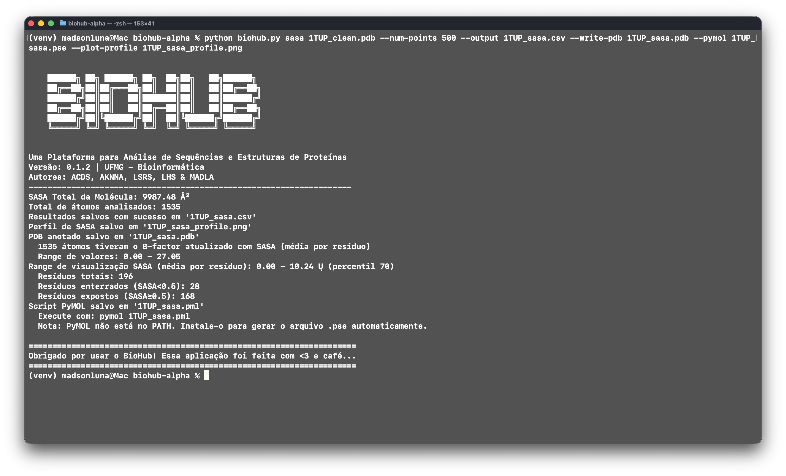
</p> 

**O que este comando faz:**
- Calcula SASA usando algoritmo de Shrake-Rupley
- Usa 500 pontos distribuídos em uma esfera ao redor de cada átomo
- Gera perfil de SASA por resíduo

**Arquivos gerados:**
- `1TUP_sasa.csv` - SASA por resíduo em Ų
- `1TUP_sasa.pdb` - PDB com B-factors = SASA
- `1TUP_sasa.pml` - Script PyMOL com visualização pré-configurada
- `1TUP_sasa_profile.png` - Gráfico do perfil de SASA

> Uma das principais saídas da função SASA é o gráfico do perfil de acessibilidade ao solvente ao longo da sequência, que ajuda a identificar regiões expostas ou enterradas ao meio.

<p align="center">
  
</p> 

#### Saída do CSV de SASA

```bash
head -20 1TUP_sasa.csv
```

**Exemplo:**
```
Residue,SASA
M1,145.32
T2,98.45
A3,12.67
M4,35.89
E5,125.43
...
```

<p align="center">
  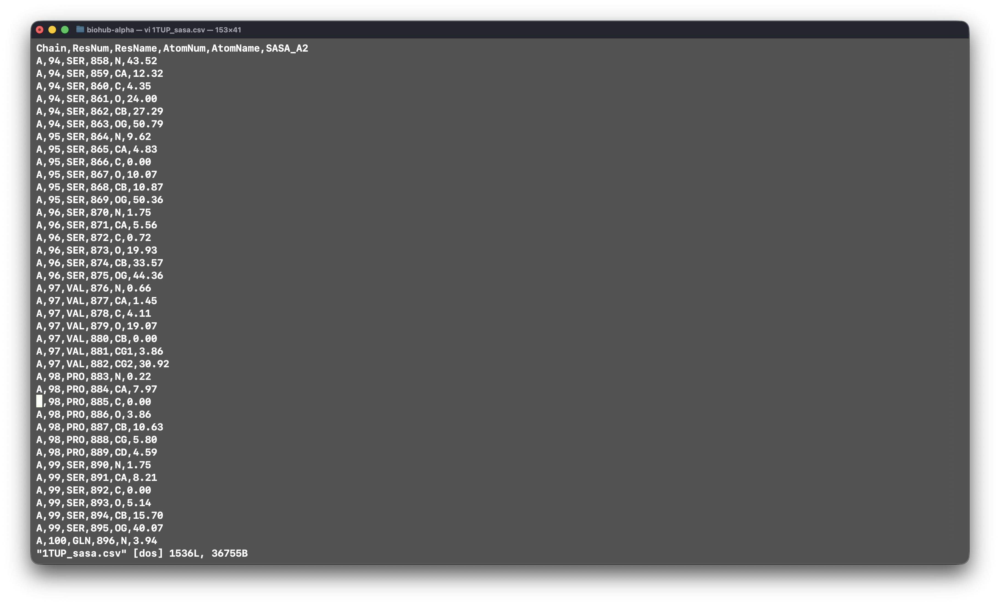
</p> 

#### Perfil de SASA inputado no PDB

<p align="center">
  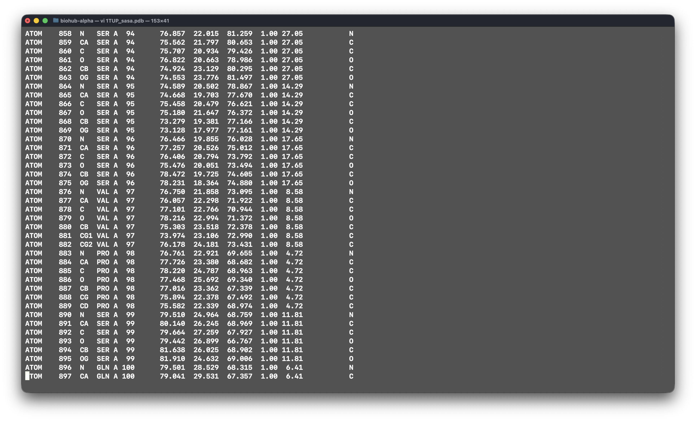
</p> 

#### Visualização PyMOL do SASA

> Mostrando alguns detalhes das configurações de um script PML gerado automaticamente para visualização no PyMOL, usando o BioHub

<p align="center">
  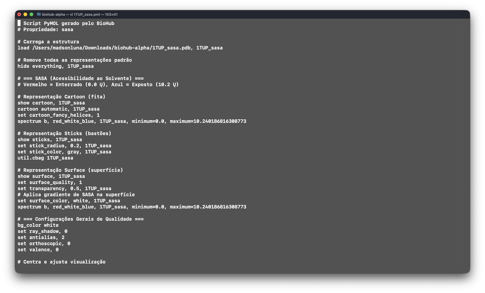
</p> 

```bash
pymol pdb + pml
```

<p align="center">
  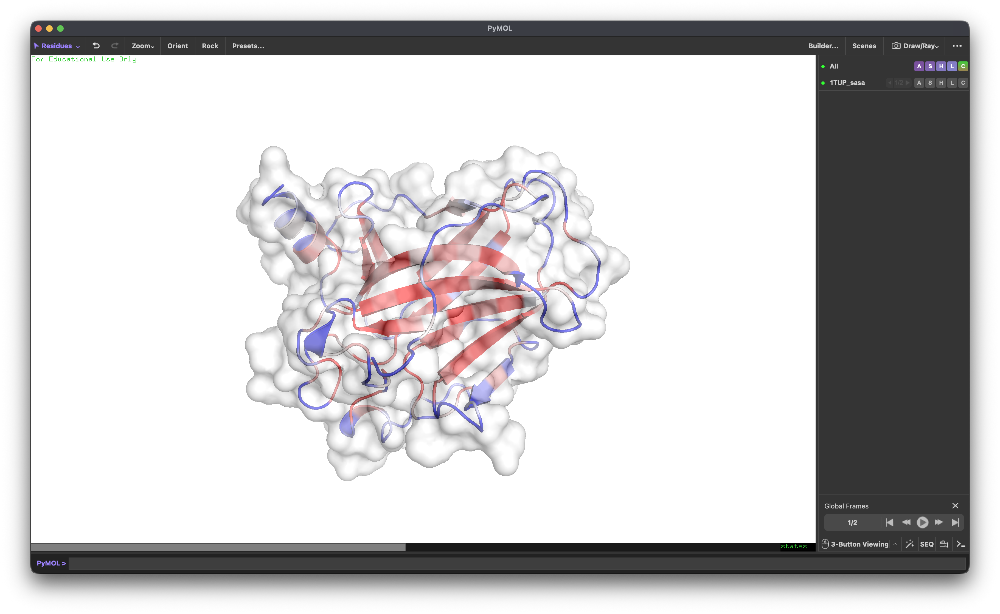
</p> 

**Esquema de cores (gradiente):**
- **Azul**: SASA baixo (resíduos enterrados)
- **Verde**: SASA intermediário
- **Vermelho**: SASA alto (resíduos expostos)

---

## 8. Todas as Visualizações

### 8.1 Resumo de todos os arquivos gerados

```bash
ls -lh
```

**Arquivos esperados:**

#### Arquivos de Dados
- `1TUP_clean.pdb` - PDB limpo (apenas cadeia A, sem heteroátomos)
- `1TUP.fasta` - Sequência em formato FASTA
- `sequences.csv` - CSV de exemplo com sequências
- `sequences.fasta` - FASTA convertido do CSV

#### CSVs de Análises
- `1TUP_properties.csv` - Propriedades físico-químicas
- `1TUP_contacts.csv` - Contatos intramoleculares
- `1TUP_hydrophoby.csv` - Predição de hidrofobicidade
- `1TUP_sasa.csv` - SASA por resíduo
- `seq1_properties.csv` - Propriedades da seq1 (KRAS)
- `seq2_properties.csv` - Propriedades da seq2 (p53)

#### Gráficos PNG
- `1TUP_composition.png` - Composição de aminoácidos
- `1TUP_treemap.png` - Treemap da composição
- `1TUP_hydropathy.png` - Perfil de hidropaticidade
- `1TUP_contact_map.png` - Mapa de contatos
- `1TUP_hydrophoby_profile.png` - Perfil de hidrofobicidade
- `1TUP_sasa_profile.png` - Perfil de SASA
- `seq1_composition.png`, `seq1_treemap.png`, `seq1_hydropathy.png`
- `seq2_composition.png`, `seq2_treemap.png`, `seq2_hydropathy.png`

#### Sessões PyMOL (.pml)
- `1TUP_hydrophoby.pml` - Visualização de hidrofobicidade
- `1TUP_sasa.pml` - Visualização de SASA

#### PDBs Modificados
- `1TUP_hydrophoby.pdb` - PDB com B-factors de hidrofobicidade
- `1TUP_sasa.pdb` - PDB com B-factors de SASA

[ADD IMAGEM AQUI - LISTAGEM COMPLETA]

---

## Notas Importantes

1. **Todos os comandos** devem ser executados dentro da pasta `demoday-biohub/`
2. O script principal está em `../biohub.py` (um nível acima)
3. Todas as análises estruturais usam o `1TUP_clean.pdb` (PDB limpo)
4. Para comandos `physchem`, cole a sequência completa extraída do FASTA
5. **PyMOL** deve estar instalado para abrir e visualizar os arquivos `.pml`

---

## Comandos Sequenciais (Cópia Rápida)

```bash
# 1. Download e limpeza
python ../biohub.py fetchpdb 1TUP --chains A --protein-only --output 1TUP_clean.pdb

# 2. PDB para FASTA
python ../biohub.py fasta 1TUP_clean.pdb --output 1TUP.fasta

# 3. Propriedades físico-químicas (cole a sequência completa do 1TUP.fasta)
python ../biohub.py physchem SEQUENCIA_COMPLETA_AQUI --output 1TUP_properties.csv --plot-composition 1TUP_composition.png --plot-treemap 1TUP_treemap.png --plot-hydro 1TUP_hydropathy.png --window 9

# 4. Criar CSV de exemplo (cole o conteúdo manualmente em sequences.csv)

# 5. CSV para FASTA
python ../biohub.py csv2fasta sequences.csv --output sequences.fasta --id-col id --seq-col sequence --header

# 6. Análises das sequências do CSV
python ../biohub.py physchem SEQUENCIA_SEQ1_AQUI --output seq1_properties.csv --plot-composition seq1_composition.png --plot-treemap seq1_treemap.png --plot-hydro seq1_hydropathy.png --window 9
python ../biohub.py physchem SEQUENCIA_SEQ2_AQUI --output seq2_properties.csv --plot-composition seq2_composition.png --plot-treemap seq2_treemap.png --plot-hydro seq2_hydropathy.png --window 9

# 7. Contatos intramoleculares
python ../biohub.py contacts 1TUP_clean.pdb --threshold 8.0 --output 1TUP_contacts.csv --plot 1TUP_contact_map.png

# 8. Hidrofobicidade
python ../biohub.py hydrophoby 1TUP_clean.pdb --output 1TUP_hydrophoby.csv --write-pdb 1TUP_hydrophoby.pdb --pymol 1TUP_hydrophoby.pml --plot-hydrophoby 1TUP_hydrophoby_profile.png

# 9. SASA
python ../biohub.py sasa 1TUP_clean.pdb --num-points 500 --output 1TUP_sasa.csv --write-pdb 1TUP_sasa.pdb --pymol 1TUP_sasa.pml --plot-profile 1TUP_sasa_profile.png
```

---

> Just one more thing...

<p align="center">
  
</p> 

## Contato

Para dúvidas ou sugestões sobre o BioHub, entre em contato.

**BioHub** - Uma plataforma completa para análise de sequências e estruturas de proteínas

Acesse o repositório no GitHub: [https://github.com/madsondeluna/biohub/tree/main] para mais informações e detalhes.
